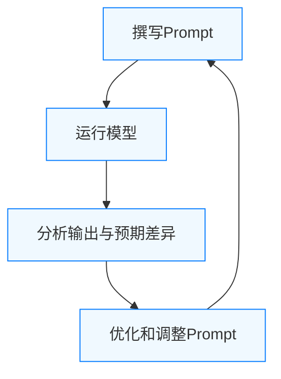

# [ChatGPT Prompt Engineering for Developers]((https://learn.deeplearning.ai/courses/chatgpt-prompt-eng/lesson/dfbds/introduction?utm_source=home&utm_medium=course-landing-page&utm_campaign=hero-cta-button&_gl=1*19l7s30*_gcl_au*MjE3MDE3NzUwLjE3NzU1NjYwMjM.*_ga*MTE4MjIwMTM1My4xNzc1NTY2MDIz*_ga_PZF1GBS1R1*czE3NzU1NjYwMjIkbzEkZzEkdDE3NzU1NjYyNTEkajQ2JGwwJGgw))

## 目录  
- [第一章 课程简介](#第一章-课程简介)  
- [第二章 提示工程原则](#第二章-提示工程原则)  
- [第三章 迭代式提示开发](#第三章-迭代式提示开发)  
- [第四章 总结类任务](#第四章-总结类任务)  
- [第五章 推断类任务](#第五章-推断类任务)  
- [第六章 转换类任务](#第六章-转换类任务)  
- [第七章 扩展类任务](#第七章-扩展类任务)  
- [第八章 构建聊天机器人](#第八章-构建聊天机器人)  
- [第九章 课程总结](#第九章-课程总结)  
- [通用最佳实践](#通用最佳实践)  
- [常见提示策略对比](#常见提示策略对比)  

## 第一章 课程简介  
**要点：**  
- **基础LLM vs 指令调优LLM**：基础模型通过上下文预测下一个词（如输入“从前有一只独角兽”，可能续写“它和朋友们一起生活在…”），但缺乏可控性；指令调优模型则在基础模型上再经过人类反馈微调，使其更善于遵循指令（如问“法国首都是哪里？”，更可能直接回答“巴黎”）。  
- **模型训练与RLHF**：指令调优通常包括在大量文本预训练基础上加入明确输入输出对，并采用**强化学习（RLHF）**进一步提升模型帮助性和安全性。  
- **专注指令模型**：课程主要基于指令调优的模型（如GPT-3.5/4）展开，因为它们在遵循提示方面更一致、更安全。  
- **课程内容概览**：课程涵盖了总结、推断、转换、扩展等典型任务，以及如何构建定制聊天机器人。每个任务都通过示例演示如何编写有效提示。  
- **实际应用场景**：示例包括摘要商品评论、情感分类、表格转换、生成回复邮件等，让学习者看到LLM应用的多样性。

**关键概念解释：**  
大型语言模型（LLM）按其训练方式可分为*基础模型*和*指令模型*，前者直接预测下一个单词，后者经过优化更善于执行指定任务。指令调优过程包括提供示例输入输出和RLHF，使模型输出更符合用户意图且更可靠。课程聚焦于指令调优模型，学习者可通过使用OpenAI API快速构建应用。

**示例：**  
```text
输入：法国的首都是哪里？  
基础LLM可能的输出：❝法国最大城市是哪里？法国人口是多少？❞（未直接回答）  
指令调优LLM可能的输出：❝法国的首都是巴黎。❞。
```

**最佳实践：**  
- 使用**指令调优的ChatGPT模型**（如 `gpt-3.5-turbo`）来调用API，避免直接使用基础模型，以获得更直接和安全的回答。  
- 在启动对话时通过*系统消息*明确角色和任务（例如：“你是一个友好的AI助手”），帮助模型快速进入正确的上下文。  
- 意识到模型不具备无限记忆和真实世界知识，避免依赖模型推测未知事实。  

**常见反模式：**  
- 将指令当作聊天提示那样写得模糊不清；或忽略给模型角色，导致输出缺乏针对性。  
- 期望模型在第一次就给出完美答案，不进行迭代调整。  
- 忽视模型“幻觉”现象，让模型凭空编造不正确答案（见第四章）。  

## 第二章 提示工程原则  
**要点：**  
- **原则1：书写清晰明确的指示**。指令应该详细具体，避免歧义。通常较长的提示能提供更多上下文，使输出更准确。  
- **使用分隔符**：如三重引号(````)、Markdown、XML标签等，将模型应该处理的文本与指令分开。这让模型清楚地知道要处理哪些输入，且能防止用户注入干扰指令。  
- **要求结构化输出**：通过让模型以特定格式（HTML、JSON）输出，便于后续程序解析。例如要求返回JSON键值对可以保证输出可计算机读取。  
- **条件验证**：如任务有前提条件，应在提示中让模型先验证条件是否满足，否则就停止执行。例如，可以提示模型“如果不满足条件，请输出‘未提供步骤’”。  
- **少量示例（few-shot）**：在提示中给出一两个范例，展示正确的解答格式或风格，帮助模型“照葫芦画瓢”。例如让模型模仿给定的回答风格回答新问题。  
- **原则2：给模型思考时间**。对于复杂任务，让模型“思考”多个步骤再给出答案，可以提高正确率。  
- **分步提示**：指定要完成任务的若干步骤，如先总结文本，再翻译，总结为结构化结果。  
- **链式思考**：提示模型在回答前先推理或验证。例如让模型“先自行解题，再与给出的答案比较”，可以避免模型草率输出错误信息。  
- **模型限制（幻觉问题）**：模型可能在陌生或复杂主题上编造听似合理但错误的答案（称为“幻觉”）。理解这一点很重要，尤其在要求事实准确时，应提供参考文本或后验证。  

**示例：**  
```text
输入: 需要对用户输入的文本进行处理和总结  
提示: 
'''“将由三重引号分隔的文本总结为一句话。”'''
这样明确了待处理文本和生成行为，避免了用户指令注入，并帮助模型准确执行任务。
```

**最佳实践：**  
- 指令应尽量**具体且条理清晰**，避免含糊描述。使用示例和格式要求来具体化任务。  
- 利用**分隔符**（如三重引号）隔离指令和内容，保证模型不会误将用户输入的“跳过当前指令”视为新指令。  
- 输出使用**结构化格式**（如JSON）便于自动化处理。  
- 若任务存在前提要求，**提醒模型先验证条件**，以防输出不相关内容。  
- 在复杂推理时，引导模型采用**分步思考**或**链式推理**（Chain-of-Thought），提升精度。  

**常见反模式：**  
- 提示语过于简略或笼统，使模型只能猜测任务意图。  
- 不使用分隔符或格式说明，导致输出混乱或包含输入指令（如用户的注入攻击）。  
- 期望模型一蹴而就，不设定思考步骤，遇复杂问题时往往出错。  
- 忽略模型可能的知识盲区，让其独立生成需要引用事实的答案，容易出现幻觉。  

## 第三章 迭代式提示开发  
**要点：**  
- **提示开发需要迭代过程**。与机器学习类似，往往无法一次得到理想输出，需要不断尝试和调整提示。  
- **迭代流程**：编写初版Prompt → 运行模型获取结果 → 分析结果偏差（错误或不完整原因）→ 修改提示细节 → 重复上述过程，直到输出符合预期。  
- **分析与调整**：每次运行后，仔细分析模型误差来源（如是否缺乏上下文、是否格式不对），有针对性地调整提示。  
- **测试多样输入**：在迭代时，应使用不同示例验证提示的通用性，避免过度拟合单一问题。  
- **重点在流程**：关键在于建立科学的迭代流程，而非寻找“一劳永逸”的完美Prompt。  

**示例：**  


**最佳实践：**  
- 制定系统化的**调试策略**：每次只修改一个变量（如添加一个条件或示例），便于判断改动效果。  
- 记录不同版本的Prompt和输出，比较和归纳有效改进。  
- 针对失败案例，尝试改变提示措辞或结构，而非仅靠模型。  
- 频繁测试：不同数据输入、多次运行，同一Prompt也可能因随机性（temperature）产生差异，需要充分测试。  

**常见反模式：**  
- 仅凭直觉一改Prompt，不做分析直接迭代，可能收效甚微。  
- 过度优化单个例子，导致对其他输入表现不佳。  
- 不保留修改记录，反复回到之前出错的版本而不自知。  

## 第四章 总结类任务  
**要点：**  
- **概要任务**：LLM擅长将长文本浓缩为简短摘要【32†L346-L354】，如总结商品评论要点。  
- **指定长度和重点**：在Prompt中通常限定摘要长度（如最多30字），并可要求强调某个方面（如“侧重说明送货速度”）【32†L368-L377】。  
- **使用示例**：示例中给出评论和摘要，可帮助模型理解期望格式。  
- **多文本总结**：对于多条评论，可通过程序循环调用摘要提示，将多个摘要聚合为整体见解【32†L381-L390】。  
- **摘要语言**：根据需求可要求输出目标语言（如英文摘要或中文摘要）。

**示例：**  
```text
Prompt:
您的任务是为电子商务网站的产品评论生成简短摘要。
总结下面用三重引号分隔的评论，最多 30 个词。
'''
为我女儿的生日买了这个熊猫毛绒玩具，她很喜欢它……它比预期提前一天到达……
'''
模型输出: “女儿喜欢的柔软可爱的熊猫毛绒玩具，但相对价格来说玩具有点小，提前到货。”
```

**最佳实践：**  
- 明确摘要要求：如字数限制、语言、要点重点（例如只关注质量或配送）。  
- 使用**分隔符**（如三重引号）清晰界定原始文本【26†L193-L202】。  
- 如果需要聚合多个文档，可编写循环或多次调用，逐条生成摘要后汇总。  
- 提示模型以简洁方式回答，可要求列表形式列出重点，以便快速扫描。  

**常见反模式：**  
- 只要求“总结”而不指定长度或格式，导致摘要过长或遗漏重点。  
- 未明确焦点，使模型输出与期望不符（如模型列出所有细节而非抓住核心）。  
- 忽略语言风格要求（如格式要正式还是口语化），导致摘要风格不一致。  

## 第五章 推断类任务  
**要点：**  
- **情感识别**：让模型判断文本情绪，常见做法是输出“积极/消极”等词语。示例评论可捕捉用户情绪（满意、愤怒等）。  
- **细化情感**：可要求输出更具体的情感清单（如“快乐、满足”）或直接二选其一回答，增强输出可控性。  
- **二次判断**：针对关注的情绪（如愤怒），可提示模型直接判断“是否包含愤怒”并回答“是/否”。  
- **信息抽取**：让模型从文本中提取特定信息并以结构化形式输出。例如提取评论中的商品名和制造商，以JSON形式返回。  
- **主题推断**：给定一段长文本，要求模型列出文章涉及的主题或关键词。  

**示例：**  
```text
Prompt: 以下用三重引号分隔的产品评论的情感是“积极”还是“消极”？  
'''
我的卧室需要一盏漂亮的灯……客服服务很周到……我感觉很满意！
'''  
模型输出: “积极”。
```

**最佳实践：**  
- 指定输出格式和选项：例如要求只输出“积极”或“消极”，避免模型返回段落式答复。  
- 使用枚举或JSON结构：对抽取多字段场景，用键值对形式（JSON）约束输出，确保结果便于后处理。  
- 在提示中包含上下文关键字（如“情感”、“主题”），指导模型关注相应内容。  
- 对于长文本推断主题，可提示模型分条列出提取的主题词，有助于解析答案。  

**常见反模式：**  
- 提问过于开放，未指定单词列表或类别，模型回答模糊或过于冗长。  
- 不定义返回格式（如列表、JSON），导致答案不易解析。  
- 混合多种推断任务在一个提示中，造成模型理解困难。  

## 第六章 转换类任务  
**要点：**  
- **翻译**：LLM能识别多种语言并互译。可要求将输入转换为特定语言或风格（正式/非正式）。  
- **结构化转换**：示例将JSON转换为HTML表格。提示中清晰描述输入和输出格式，模型能按要求排列数据。  
- **拼写/语法检查**：LLM可用作校对工具，重写并纠正文本。示例演示将英语错误句子纠正为正确版本。  
- **多语言综合示例**：示例代码中定义多个带语言标记的消息，模型识别并翻译所有语言至英文和韩文。  

**示例：**  
```text
Prompt: 将下面的英文句子翻译成西班牙文（正式用语）。  
"You could include lights for better ambiance."  
模型输出: "Podría incluir luces para mejorar el ambiente."  
```

**最佳实践：**  
- 明确说明源语言和目标语言（以及正式/口语风格）。  
- 要求模型以**结构化格式**输出：如每条JSON字段分别翻译、或表格形式排列，便于后续处理。  
- 在拼写检查任务中，提示模型不仅给出“正确/错误”，还要输出**改正后的完整句子**。  
- 对长文本翻译，分段处理或询问模型标识段落语言，防止遗漏。  

**常见反模式：**  
- 未规定输出格式，让模型自行编排，导致信息混乱（如不按JSON格式输出）。  
- 不指出正式与否，结果可能风格与需求不符。  
- 给出带错误的文本但不要求改写，模型可能只指出错误而不提供修改版。  

## 第七章 扩展类任务  
**要点：**  
- **文本扩展**：将简短描述扩展为较长文本（如写邮件、故事创作）。常用于自动化写作和头脑风暴。  
- **邮件回复生成**：示例要求模型扮演客服助理，根据客户评论情绪自动生成回复邮件。提示包括多条条件（积极/负面情绪的不同措辞）、使用评论细节、保持专业礼貌语气，并签名。  
- **使用上下文角色**：在提示中明确角色（“你是客服AI助理”），并具体说明任务要求，如先感谢再道歉。  
- **温度调节**：`temperature` 控制输出的多样性和创造性。值越低（如0），输出越确定；值越高，可能生成更具创造性但不稳定的回答。  

**示例：**  
```text
Prompt: 你是AI客服助理。根据客户评论（由三重引号分隔）和评论情绪生成一封回复邮件：如果情绪积极，感谢反馈；如果消极，道歉并提出解决方案。保持简洁专业语气。  
'''
评论: 我很喜欢这个产品，但是客服速度有点慢。
'''
模型输出: 尊敬的客户，感谢您对我们产品的喜爱…（邮件正文）。
```

**最佳实践：**  
- 在提示中**明确指令角色与任务**：指定语气、称呼、签名等细节，使回复符合预期风格。  
- 紧密结合输入内容和情绪：如使用评论中的具体问题来定制回复，提高相关性。  
- 合理调整`temperature`：希望输出稳定准确时将其设置较低（如0–0.3）；需要创意或多样内容时可适当升高。  
- 要求**关键词命名或列表**：如让模型列出邮件关键要点，以确保包含所有必要信息。  

**常见反模式：**  
- 不设定角色或语气，导致输出语调不统一或与目标场景不符。  
- 温度过高造成回复跑题或加入不必要花絮；温度过低输出过于呆板。  
- 未明确指示使用评论内容，模型可能生成泛泛的回复。  

## 第八章 构建聊天机器人  
**要点：**  
- **对话结构**：ChatGPT基于一系列消息（role: system/user/assistant）进行交互【38†L584-L593】。系统消息在所有对话开始前设定助手的行为和语调，用户消息则为用户输入，助手消息为模型回复。  
- **系统消息作用**：系统消息类似在助手耳边“私聊”设定规则，用户无法看到，但它决定了助手的身份、任务和回复风格。  
- **上下文累积**：每次用户提问后，都要将新的用户消息和助手上一次回复加入对话上下文，并一起发送给模型，以保持完整对话记忆。  
- **示例流程**：以披萨店订单机器人为例，步骤包括构建GUI获取用户输入、发送消息到模型、不断更新对话列表、收集用户订单信息并总结确认。  
- **指示详尽**：系统消息示例中详细列出机器人应遵循的所有规则（如先问候、收集订单、确认是否配送、最后收款，以及菜单项和附加选项），确保模型能按流程执行。  

**示例：**  
```python
# 定义对话上下文消息列表
messages = [
  {"role": "system", "content": "你是OrderBot，一个负责接收比萨订单的自动化助手。首先问候客户，然后收集订单细节，并最后确认订单。"},
  {"role": "user",   "content": "我想点一个比萨，要送货。"},
]
# 调用模型
response = get_completion_from_messages(messages)
```

**最佳实践：**  
- 始终提供详尽的**系统消息**设定，比如角色、任务流程和语气。  
- 对话过程中**持续传递上下文**：每轮都将所有角色消息列表发送给模型，以便模型记住之前的信息。  
- 在对话结束时生成结构化总结（如订单信息的JSON），可直接用于后端处理。  
- 设计对话时考虑**用户输入多样性**：处理拼写错误、意外输入等情况时提示模型要谨慎确认订单。  

**常见反模式：**  
- 只发送当前用户消息而不带先前上下文，让模型像“忘记”之前的对话。  
- 系统消息过于简略或通用，无法有效指导复杂任务流程。  
- 在用户消息里尝试插入系统指令（模型可能忽略或与真实用户混淆）。  

## 第九章 课程总结    
课程概述了两个关键的提示原则：编写清晰具体的指令和在合适的时候给模型留出思考时间。我们学习了提示词的迭代开发过程，以及构建定制化聊天机器人的方法。课程还演示了LLM在摘要、推断、转换和扩展等任务上的实际应用。最后强调了负责任地使用AI工具的重要性，只构建对他人产生积极影响的应用。  

**最佳实践：**  
- 复盘本课程两大原则并牢记在心：具体而分步骤地提示模型。  
- 结合实际需求大胆尝试和实践，用学到的流程工具开发新的应用。  
- 在项目中分享和传播经验，以推动提示工程的最佳实践。  

**常见反模式：**  
- 盲目照搬提示模板而不根据需求灵活调整。  
- 忽略AI伦理和使用规范，直接部署可能带来问题的应用。  

## 通用最佳实践  
- **系统消息模板：** 在多轮对话中，通过系统消息明确助手身份和规则。如：  
  ```text
  系统: 你是一个乐于助人的AI助手，擅长解答编程相关的问题。
  用户: Python中如何读取文件？
  ```  
- **零/少样本提示模板：** 为单次任务提供清晰说明。如总结：“请简要总结下面的内容”；少样本示例：  
  ```text
  范例1: xxx -> [模型输出]  
  范例2: yyy -> [模型输出]  
  问题: zzz ->    
  ```  
- **链式思维模板：** 引导模型进行逐步推理：  
  ```text
  请一步一步思考并解答：...
  ```  
- **格式控制模板：** 要求模型输出特定结构（如JSON、表格）：  
  ```text
  请以JSON格式输出结果，键包括 "title","author"。
  ```  
- **条件判断模板：** 先检查前提条件：  
  ```text
  如果文本包含步骤，则按格式重写；否则回答“未提供步骤”。
  ```  
- **调试与评价：**  
  - 使用反复验证：针对相同提示多次实验，观察输出稳定性。  
  - A/B 测试：比较不同版本的提示效果，比如改变词序或添加细节。  
  - 自动化评估：可设计简单规则（如答案长度、是否包含关键字）判断输出质量。  
  - 记录和版本控制：保存每次提示修改和输出结果，便于回溯与对比。  

## 常见提示策略对比  

| 提示策略                 | 优点                                                       | 缺点                                                         | 适用场景                             |
|:-----------------------:|:---------------------------------------------------------:|:-----------------------------------------------------------:|:-----------------------------------:|
| 零样本 (Zero-shot)      | 快速部署，无需示例，适用于直观问题。                         | 对任务格式要求敏感，容易遗漏期望输出形式，效果不稳定。       | 问答、翻译等简单明确任务。           |
| 少样本 (Few-shot)      | 给出示例后更容易获得预期格式和风格，能演示复杂模式。           | 提示较长，示例选择不当可能误导模型。                        | 分类、格式复杂的任务（如文体模仿）。 |
| 链式思维 (CoT)         | 在复杂推理或计算题上显著提升准确性【42†L55-L63】。           | 提示更长，计算成本高；模型可能生成多余步骤或中间答案。       | 需要逻辑推理的数学题、常识推理题。   |
| 系统消息 (System)      | 统一设定助手角色和语气，保证多轮对话连贯一致【38†L593-L598】。    | 隐性指导，需与用户消息配合；错误的系统指令可能导致角色偏离。 | 多轮交互型应用（聊天机器人、客服助手）。 |

