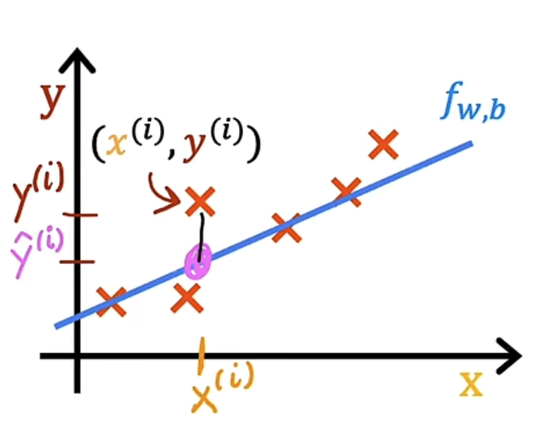
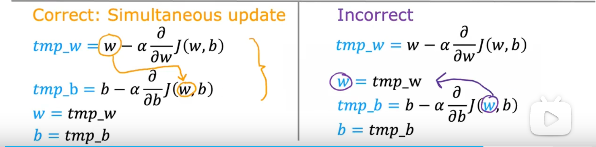
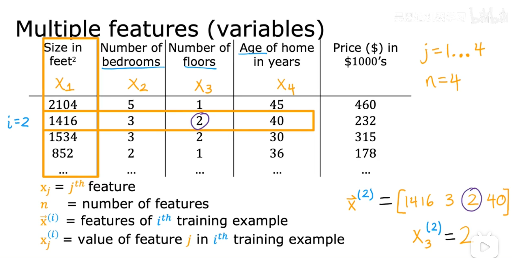
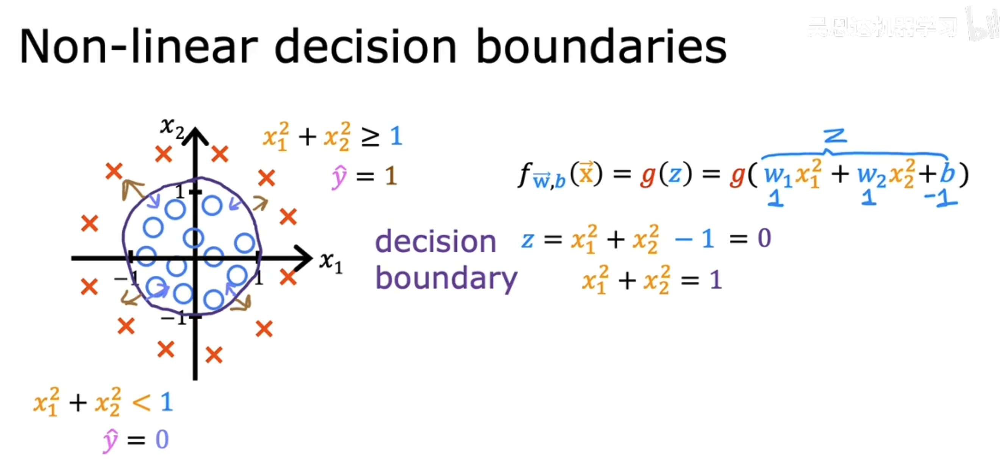
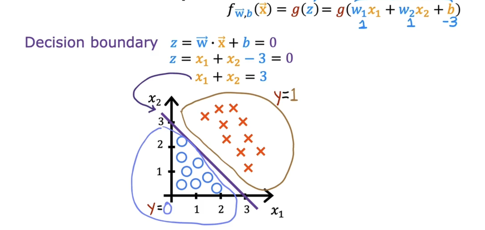

## 什么是机器学习

### 监督学习（Supervised Learning）

**X(Input) -> Y(Output)** 的算法，监督学习的关键特征是你给学习算法**提供学习的例子**。  

实际应用场景下的 X -> Y

1. 垃圾邮件过滤器：Email -> 是否垃圾邮件
2. 语音识别：音频片段 -> 文本转录
3. 机器翻译：English -> 任意语言
4. 在线广告：广告信息、用户信息 -> 广告点击（产生收入）
5. 汽车自动驾驶：图像、传感器（雷达）-> 输出其它车辆位置
6. 视觉检测：手机产品图片 -> 是否有缺陷

监督学习算法的两大类型：

- **回归算法(Regression)**：房屋面积对应房价预测。
- **分类算法(Classification)**：肿瘤预测。


### 非监督学期（Unsupervised Learning）

使用最为广泛。  
仅有**X(Input)**，没有**Y（Ouput）**。  

被称为无监督意为并不是试图监督算法为每个问题的输入给出某个所谓的正确答案，而是为了让算法自己在这些数据中找出有什么有趣的东西或可能存在的模式或结构。


主要非监督学习算法：

- **聚类算法(Clustering)**：谷歌新闻（相关文章推荐）
- **异常检测**：金融系统的欺诈检测。
- **降维算法**：


## 单变量线性回归 

### 线性回归模型

一些标准化术语

- 训练集（Training set）：用来训练模型的数据集合。
- x：输入变量，也被称为输入特征（小写）。
- y：预测的变量或目标变量（小写）。
- m：训练集的总数（小写）。
- y-hat：y的估计值或预测值（$\hat{y}$）。
- 模型（learning algorithm）：x -> y 的函数。

单变量线性回归函数公式：$f_{w,b}(x) = wx + b$  
w,b: 模型参数 (paramerters) （又叫系数、权重） 
模型参数是在训练中可以调整的变量，以改进模型。

### 代价函数：Cost Function



*假设函数（Hypothesis Function）表达式；*

$\hat{y}^{(i)} = f_{w,b}(x^{(i)})$  

*线性回归模型可以表示为：*

$f_{w,b}(x^{(i)}) = wx^{(i)} + b$  

寻找参数 $w$ 和 $b$，使得对于所有的训练样本，预测值 $\hat{y}$ 都尽可能地接近真实值 $y$。

*代价函数表达式：*

$$J(w,b) = \frac{1}{2m} \sum_{i=0}^{m-1} (f_{w,b}(x^{(i)}) - y^{(i)})^2$$

衡量模型预测y与y的真实值之间的差异。

线性回归目标：找到尽量小的差异。

$$\underset{w,b}{\text{minimize }} J(w,b)$$


## 阶梯下降

### 公式 

$$w = w - \alpha \frac{\partial}{\partial w} J(w, b)$$
 

$$b = b - \alpha \frac{\partial}{\partial b} J(w, b)$$


阶梯算法需要同时更新参数w、b

$\alpha $ ：学习率 (Learning rate)，介于0 ～ 1 之间的一个正数，**控制你向下迈步的大小**。  

$\frac{\partial}{\partial w} J(w, b)$：代价函数J的导数项（Derivative)，**告诉你往哪个方向走**。

重复以上公式的更新步骤，直到算法**收敛**。  
**收敛**：达到一个局部最小值点，此时每迈出一步，参数w和b不再有太大变化。  

### 更新过程：



### 学习率

学习率 $\alpha$ 的选择对梯度下降实现的效率有巨大影响。

学习率过小：可以正常工作但效率极低。  
学习率过大：梯度下降可能无法收敛甚至发散，无法工作。

### 线性回归的梯度下降

线形回归模型函数：$f_{w,b}(x) = wx + b$   

代价函数：$J(w,b) = \frac{1}{2m} \sum_{i=1}^{m} (f_{w,b}(x^{(i)}) - y^{(i)})^2$

梯度下降公式：$w = w - \alpha \frac{\partial}{\partial w} J(w, b)$、 $b = b - \alpha \frac{\partial}{\partial b} J(w, b)$

线性回归的`导数`部分，通过微积分推导：

$\frac{\partial}{\partial w} J(w, b)$   $\longrightarrow$   $\frac{1}{m} \sum_{i=1}^{m} (f_{w,b}(x^{(i)}) - y^{(i)})x^{(i)}$   

$\frac{\partial}{\partial b} J(w, b)$   $\longrightarrow$   $\frac{1}{m} \sum_{i=1}^{m} (f_{w,b}(x^{(i)}) - y^{(i)})$  

线形回归算法的梯度下降公式：

$
\text{repeat} \{ \\
    \quad \quad w = w - \alpha \cdot \frac{1}{m} \sum \left( f_{w,b}(x^{(i)}) - y^{(i)} \right) x^{(i)} \\
    \quad \quad b = b - \alpha \cdot \frac{1}{m} \sum \left( f_{w,b}(x^{(i)}) - y^{(i)} \right) \\
    \quad \\
    \quad \quad\text{同时更新 } w, b \\
\}
$


线性回归梯度下降的成本函数只有一个**全局最小值**。


## 多元线性回归



### 一些新的符号

$x_j$：第j个特征。

$n$：特征的总数。  

$\vec{x}^{(i)}$：第 $i$ 个训练集的所有特征值。

$x^{(i)}_j$： 第 $i$ 个训练样本中第 $j$ 个特征的具体取值。

### 模型

单变量模型：$f_{w,b}(x) = wx + b$  

多变量模型：$f_{w,b}(\vec{x}) = w_1 x_1 + w_2 x_2 + ... + w_n x_n + b$

向量化表示的多变量模型：$f_{w,b}(\vec{x}) = \vec{w} \cdot \vec{x} + b$，其中：

1. $\vec{w} = [w_1 \ w_2 \ w_3 \ \dots \ w_n]$   
2. $\vec{x} = [x_1 \ x_2 \ x_3 \ \dots \ x_n]$
3. $\vec{w} \cdot \vec{x}$：向量点积（dot product），等价于 $w_1 x_1 + w_2 x_2 + ... + w_n x_n$

称为：多元（特征）线性回归（Multivariate Linear Regression）  

### 向量化

当学习实现多变量线性回归算法时，向量化（Vectorization）是一个重要的概念。不仅可以使代码更简洁，还可以利用底层的线性代数库（如NumPy），甚至利用GPU硬件来加速计算。

Python代码实现：$f_{w,b}(\vec{x}) = \vec{w} \cdot \vec{x} + b$

```python
import numpy as np  
w = np.array([1.0, 2.5, -3.3])
b = 4
x = np.array([10, 20, 30])

f = np.dot(w, x) + b
```
NumPy的`dot`函数并行硬件利用能力使其比使用Python的for循环更快地计算向量点积。

### 向量化后的代价函数

$J(\vec{w}, b) = \frac{1}{2m} \sum_{i=1}^{m} (f_{\vec{w},b}(\vec{x}^{(i)}) - y^{(i)})^2$

### 多元线性回归的梯度下降

$
\text{repeat} \{ \\
 \qquad w_1 = w_1 - \alpha \frac{1}{m} \sum_{i=1}^m \bigl( f_{\overline{w}, b}(\vec{x}^{(i)}) - y^{(i)} \bigr) x_1^{(i)} \\
 \qquad \qquad \vdots \\[4pt]
 \qquad w_n = w_n - \alpha \frac{1}{m} \sum_{i=1}^m \bigl( f_{\overline{w}, b}(\vec{x}^{(i)}) - y^{(i)} \bigr) x_n^{(i)} \\[4pt]
 \qquad \\
 \qquad b = b - \alpha \frac{1}{m} \sum_{i=1}^m \bigl( f_{\overline{w}, b}(\vec{x}^{(i)}) - y^{(i)} \bigr) \\
 \qquad \\
 \qquad \text{同时更新 } w, b \\
 \qquad w_j \text{ (for } j = 1, \cdots, n) \text{ and } b \\
\}
$

## 正规方程

正规方程（Normal Equation）是线性回归的另一种解析方法（不推荐）：
1. *仅适用于线性回归模型。*
2. 不需要迭代更新参数。  

缺点： 

1. 仅适用于线性回归；不能推广到其他算法，例如逻辑回归算法、神经网络；
2. 特征数量庞大时，计算速度缓慢（>10,000）。

*一些机器学习库可能在内部使用这种算法来实现求解 w 和 b*

## 特征缩放

### 什么是特征缩放

特征缩放（Feature Scaling）是一个重要的预处理步骤，旨在将不同特征的数值调整到同一尺度，以提高梯度下降算法的效率和收敛速度。

### 为什么需要特征缩放

当不同特征的取值范围相差很大时（如房屋面积 0–2000 平方英尺，卧室数量 1–5 个），代价函数的等高线会呈现瘦长的椭圆形，导致梯度下降在椭圆等高线上反复横跳，需要非常多次迭代才能收敛。

这是因为特征取值大时，其对应的参数权重会变小；特征取值小时，对应参数权重会变大。参数权重差异过大，使得梯度下降路径呈锯齿状，收敛缓慢。

进行特征缩放后，等高线变为接近圆形，梯度下降路径顺畅，收敛速度显著加快

### 如何实现特征缩放

#### 最大值缩放（Feature Scaling）

将每个特征值除以特征的范围（最大值减最小值），使缩放后的值落在 [0,1] 区间。

例：300 <= x1 <= 2000，0 <= x2 <= 5

$x_{1, \text{scaled}} = \frac{x_1}{2000 \,}$  , 0.15 <= $x_{1, \text{scaled}}$ <= 1 

$x_{2, \text{scaled}} = \frac{x_2}{5 \,}$，0 <= $x_{2, \text{scaled}}$ <= 1

#### 均值归一化（Mean Normalization）

例：300 <= x1 <= 2000，0 <= x2 <= 5

将特征值减去训练集上的均值后再除以特征范围（最大值减最小值），缩放后的数据通常落在 [-1,1] 区间。

$\mu_1$：训练集上的$x_1$的均值，假设：$\mu_1$=600

$x_1 = \frac{x_1 - \mu_1}{2000-300 \,}$ ， -0.18 <= $x_1$ <= 0.82 

$\mu_2$：训练集上的$x_2$的均值，假设：$\mu_2$=2.3

$x_2 = \frac{x_2 - \mu_2}{5-0 \,}$ ， -0.46 <= $x_1$ <= 0.54 

#### Z-score 标准化 

计算每个特征的标准差：$\sigma$ ，假设 $\sigma_1$ = 450，$\sigma_2$ = 1.4

$\mu_1$：训练集上的$x_1$的均值，假设：$\mu_1$=600 

$\mu_2$：训练集上的$x_2$的均值，假设：$\mu_2$=2.3 

$x_1 = \frac{x_1 - \mu_1}{\sigma_1 \,}$， -0.67 <= $x_1$ <= 3.1

$x_2 = \frac{x_2 - \mu_2}{\sigma_2 \,}$， -1.6 <= $x_2$ <= 1.9

#### 缩放成功的标准 

缩放后的特征范围通常接近 [-1,1] 区间，[-3,3] 或 [-0.3,0.3] 也是可以接受的。如果缩放后的范围过大或过小，需要重新缩放特征。


## 判断梯度下降是否收敛

### 绘制“学习曲线”

每次迭代后，计算当前参数下的代价函数值 $J(w,b)$，并将其记录下来，然后画出迭代次数（x轴）与代价函数值（y轴）的关系图，称为学习曲线（Learning Curve）。

### 动收敛测试

设置一个很小的阈值 $ \varepsilon$（例如 \( 10^{-3} \)）。如果连续几次迭代，损失值的下降量都小于 $ \varepsilon$，就认为收敛。 

**但要注意**：
- 阈值选得太小，可能永远达不到（浪费计算）。
- 选得太大，可能提前停止（没找到真正的最小值）。

## 如何设置学习率

学习率 $\alpha$ 决定了梯度下降每一步迈出的“步长”。如果 $\alpha$ 设置得当，代价函数 $J(\vec{w}, b)$ 应该在每一次迭代后都持续下降。

### 识别学习率的问题

如果 $J(\vec{w}, b)$ 在迭代过程中没有下降，通常意味着学习率 $\alpha$ 设置存在问题：

- $\alpha$ 太小： * 表现： $J$ 下降得极其缓慢，需要海量的迭代次数才能收敛。 
  - 对策： 适当增大 $\alpha$。

- $\alpha$ 太大：
  - 表现 1： $J$ 在每一轮迭代中上下波动（Fluctuate），有时增加有时减少。
  - 表现 2： $J$ 随着迭代不断增加，出现**发散（Diverge）**现象。
  - 原因： 步子迈得太大，直接越过了最小值点，导致在谷底两侧来回跳跃并逐渐远离。
  - 对策： 减小 $\alpha$。


### 如何选择$\alpha$的值

建议采用**指数级**的方式来选择 $\alpha$ 的值。

**推荐的尝试步骤：**

1. 从一个较小的值开始，例如 0.001。
2. 每次以约 3 倍的跨度增加：

$$0.001 \rightarrow 0.003 \rightarrow 0.01 \rightarrow 0.03 \rightarrow 0.1 \rightarrow 0.3 \rightarrow 1 \dots$$

3. 对于每一个选定的 $\alpha$，运行几个迭代观察 $J$ 的变化。

**选择逻辑：**

- 找到一个使 $J$ 迅速且持续下降的最大可能值。
- 或者找到一个明显太大的值（导致不收敛），然后选择比它稍微小一点的那个稳健值。

## 特征工程

### 定义和核心概念

特征工程是指利用你对问题的直觉（Intuition）或专业知识，通过对原始特征进行变换或组合，来定义新特征的过程。

- 目的： 使模型能够更好地拟合数据（尤其是非线性数据）。
- 关键点： 好的特征往往比复杂的算法更能决定模型的上限。

### 特征组合示例：房屋面积

以预测房价为例，假设原始特征有两个：

- $x_1$：地块的宽度（width）
- $x_2$：地块的深度（depth）

虽然可以分别使用 $x_1$ 和 $x_2$ 进行线性回归，但通过常识我们知道，面积通常是决定房价更重要的因素。

因此，我们可以创建一个新特征 $x_3$：

$$x_3 = x_1 \times x_2$$

此时，模型变为：

$$f_{\vec{w},b}(x) = w_1x_1 + w_2x_2 + w_3x_3 + b$$

## 多项式回归 

通过多元线性回归的思想和特征工程的方法，提出一个新的算法称为**多项式回归（Polynomial Regression）**。它将让你拟合曲线、非线性函数到你的数据。

### 核心概念

多项式回归允许你使用线性回归的机制来拟合非线性函数（如曲线）。其核心技巧是将原始特征的高次方（如 $x^2, x^3$）视为独立的新特征。

### 模型构建

假设我们只有一个原始特征：房屋面积 $x$。

- 线性模型： $f_{w,b}(x) = w_1x + b$ （只能拟合直线）
- 二次模型： $f_{w,b}(x) = w_1x + w_2x^2 + b$ （可以拟合抛物线）
- 三次模型： $f_{w,b}(x) = w_1x + w_2x^2 + w_3x^3 + b$ （可以拟合更复杂的曲线）

**关键点**： 尽管特征 $x$ 与目标值 $y$ 之间是非线性关系，但对于参数 $w_1, w_2, w_3$ 而言，这个方程仍然是线性的。因此，我们依然可以使用梯度下降法来求解。

### 特征的选择与直觉

- **如果数据先上升后下降**：二次函数（$x^2$）可能比较合适。但需注意，二次函数在达到顶点后会强制下降，这可能不符合某些实际场景（如房价通常不会随面积增大而降低）。
- **如果数据持续上升但增速放缓：**：
    - 可以使用三次函数：$f_{w,b}(x) = w_1x + w_2x^2 + w_3x^3 + b$。
    - 也可以使用平方根函数：$f_{w,b}(x) = w_1x + w_2\sqrt{x} + b$。

#### 必须注意：特征缩放（Feature Scaling）

这是多项式回归中最重要的实践细节。当你引入高阶项时，特征的取值范围会剧烈膨胀。

**例子**： 如果面积 $x$ 的范围是 $1 \sim 1000$：

- $x$ 的范围：$1 \sim 1,000$
- $x^2$ 的范围：$1 \sim 1,000,000$
- $x^3$ 的范围：$1 \sim 1,000,000,000$

**后果**： 如果不进行缩放，梯度下降算法在更新参数时会极其不稳定，甚至无法收敛。  
**建议**： 在运行梯度下降之前，必须应用 Z-score 标准化 (Standardization) 或 最大最小归一化 (Normalization)，使所有特征（包括 $x, x^2, x^3$）都处于相似的数值范围。


## 逻辑回归分类

逻辑回归是一种用于分类问题的算法，尽管名字里有“回归”，但它实际上是一个分类算法。


### Sigmoid函数

逻辑回归的核心思想是将线性回归的输出通过一个 **特殊的函数（Sigmoid函数）** ，又叫 **逻辑函数** 转换为一个概率值，从而实现二分类。

$$
\text{g}(z) = \frac{1}{1 + e^{-z}} ，0 < \text{g}(z) < 1，z = \vec{w} \cdot \vec{x} + b 
$$

### 逻辑回归模型


**模型公式**：

$$
f_{\vec{w},b}(\vec{x}) = \text{g}(\vec{w} \cdot \vec{x} + b) = \frac{1}{1 + e^{-(\vec{w} \cdot \vec{x} + b)}}
$$  

或在逻辑回归的研究论文或博客文章中看到：

$$ 
f_{\vec{w},b}(\vec{x}) = \text{P}(y=1 | \vec{x}; \vec{w}, b)
$$

通常把输出看作在给定某个输入特征 $\vec{x}$ 的条件下，事件 $y=1$ 发生的概率：$ P(y=0) + P(y=1) = 1 $

### 决策边界（Decision Boundary）

逻辑回归模型输出的是一个概率值，通常我们会设置一个阈值（如0.5）来进行分类：
- 如果 $f_{\vec{w},b}(\vec{x}) \geq 0.5$，则预测 $y=1$。
- 如果 $f_{\vec{w},b}(\vec{x}) < 0.5$，则预测 $y=0$。

决策边界是指在特征空间中将不同类别分开的边界线（或面）。

对于逻辑回归，决策边界由 $\vec{w} \cdot \vec{x} + b = 0$ 定义。

决策边界的形状取决于特征的数量和模型的复杂度：
- 线性决策边界：当模型是线性的（如 $f_{\vec{w},b}(\vec{x}) = \text{g}(\vec{w} \cdot \vec{x} + b)$）时，决策边界是一条直线。 

<div align="center"></div>

- 非线性决策边界：通过特征工程（如引入多项式特征）或使用更复杂的模型（如神经网络），可以得到非线性的决策边界，能够更好地拟合复杂的数据分布。  

<div align="center"></div>

