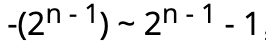

# Rust 基础入门

## 变量绑定与解构

### 变量命名
遵循 [Rust 命名规范](https://course.rs/practice/naming.html)，关键字查看[附录A](https://course.rs/appendix/keywords.html)。

### 变量绑定

```rust
let a = "hello world" 
```

明确所有权概念，所以称之为"变量绑定"。

### 变量可变性
Rust 的变量在默认情况下是**不可变的**，使用`mut`关键字让变量可变。
```rust
// 错误
let x = 5;
x = 5;
error[E0384]: cannot assign twice to immutable variable `x`

// 正确
let mut x = 5;
x = 5;
```

### 使用下划线开头忽略未使用的变量

```rust 
 let _x = 5;
```

### 变量解构

```rust
let (a, mut b): (bool, bool) = (true, false);

let (a, b, c, d, e);
(a, b) = (1, 2);
[c, .., d, _] = [1, 2, 3, 4, 5];
Struct { e, .. } = Struct { e: 5 };

```
**+=** 的赋值语句还不支持解构式赋值。

### 变量与变量之间的差异

- 常量不能使用`mut`，常量始终不可变。
- 常量使用`canst` 关键字。
```rust 
const MAX_POINTS: u32 = 100_000;
```

### 变量遮蔽（shadowing）

允许声明相同的变量名，后者遮蔽前者。

```rust 
fn main() {
   let x = 5;
    // 在main函数的作用域内对之前的x进行遮蔽
   let x = x + 1;

   {
      // 在当前的花括号作用域内，对之前的x进行遮蔽
      let x = x * 2;
   }
}
```

变量遮蔽**涉及一次内存对象的再分配**，而`mut`只是修改同一内存地址上的值。

## 基本类型

### 基本类型

- 数值类型：有符号整数 (`i8`, `i16`, `i32`, `i64`, `isize`)、 无符号整数 (`u8`, `u16`, `u32`, `u64`, `usize`) 、浮点数 (`f32`, `f64`)、以及有理数、复数。
- 字符串：字符串字面量和字符串切片 &str。
- 布尔类型：`true` 和 `false`。
- 字符类型：表示单个 Unicode 字符，存储为 4 个字节。
- 单元类型：即 `()` ，其唯一的值也是 `()`。

### 类型推导与标注

Rust是一门**静态语言**。可以根据上下文推导变量类型，但某些情况下仍然需要手动标注。

### 数值类型

#### 整数类型

Rust 整型默认使用 `i32`，即：
```rust
let i = 10; // 默认32位
```

`i`代表有符号整数，例如`i32`：32位有符号整数。
`u`代表无符号整数，例如`u32`：32位无符号整数。

- 类型定义的形式统一为：**有无符号 + 类型大小(位数)**。
- 每个有符号类型规定的数字范围是{width=200px height=25px}，例`i8`可存储范围：**-128 ~ 127**。
- `isize`，`usize`取决运行时CPU，若CPU是32位则这个类型是`i32`。
- 整形字面量
  - 十进制：`98_222`
  - 十六进制：`0xff`
  - 八进制：`0o77`
  - 二进制：`0b1111_0000`
  - 字节 (仅限于 u8)：`b'A'`