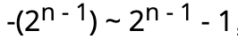

# Rust 基础入门

## 变量绑定与解构

### 变量命名
遵循 [Rust 命名规范](https://course.rs/practice/naming.html)，关键字查看[附录A](https://course.rs/appendix/keywords.html)。

### 变量绑定

```rust
let a = "hello world" 
```

明确所有权概念，所以称之为**"变量绑定"**。**不要简单理解成赋值**。

### 变量可变性
Rust 的变量在默认情况下是**不可变的**，使用`mut`关键字让变量可变。
```rust
// 错误
let x = 5;
x = 5;
error[E0384]: cannot assign twice to immutable variable `x`

// 正确
let mut x = 5;
x = 5;
```

### 使用下划线开头忽略未使用的变量

```rust 
 let _x = 5;
```

### 变量解构

```rust
let (a, mut b): (bool, bool) = (true, false);

let (a, b, c, d, e);
(a, b) = (1, 2);
[c, .., d, _] = [1, 2, 3, 4, 5];
Struct { e, .. } = Struct { e: 5 };

```
**+=** 的赋值语句还不支持解构式赋值。

### 变量与变量之间的差异

- 常量不能使用`mut`，常量始终不可变。
- 常量使用`canst` 关键字。
```rust 
const MAX_POINTS: u32 = 100_000;
```

### 变量遮蔽（shadowing）

允许声明相同的变量名，后者遮蔽前者。

```rust 
fn main() {
   let x = 5;
    // 在main函数的作用域内对之前的x进行遮蔽
   let x = x + 1;

   {
      // 在当前的花括号作用域内，对之前的x进行遮蔽
      let x = x * 2;
   }
}
```

变量遮蔽**涉及一次内存对象的再分配**，而`mut`只是修改同一内存地址上的值。

## 基本类型

### 基本类型

- 数值类型：有符号整数 (`i8`, `i16`, `i32`, `i64`, `isize`)、 无符号整数 (`u8`, `u16`, `u32`, `u64`, `usize`) 、浮点数 (`f32`, `f64`)、以及有理数、复数。
- 字符串：字符串字面量和字符串切片 &str。
- 布尔类型：`true` 和 `false`。
- 字符类型：表示单个 Unicode 字符，存储为 4 个字节。
- 单元类型：即 `()` ，其唯一的值也是 `()`。

### 类型推导与标注

Rust是一门**静态语言**。可以根据上下文推导变量类型，但某些情况下仍然需要手动标注。

### 数值类型

#### 整数类型

Rust 整型默认使用 `i32`，即：
```rust
let i = 10; // 默认32位
```

`i`代表有符号整数，例如`i32`：32位有符号整数。
`u`代表无符号整数，例如`u32`：32位无符号整数。

- 类型定义的形式统一为：**有无符号 + 类型大小(位数)**。
- 每个有符号类型规定的数字范围是{width=200px height=25px}，例`i8`可存储范围：**-128 ~ 127**。
- `isize`，`usize`取决运行时CPU，若CPU是32位则这个类型是`i32`。
- 整形字面量
  - 十进制：`98_222`
  - 十六进制：`0xff`
  - 八进制：`0o77`
  - 二进制：`0b1111_0000`
  - 字节 (仅限于 u8)：`b'A'`

##### 整数溢出


#### 浮点类型
两种基本类型：`f32`和`f64`，默认是`f64`。浮点数根据 IEEE-754 标准实现，存在**浮点数陷阱**。
`f32`单精度，`f64`双精度。

##### 浮点数陷阱

##### NaN
`NaN`：表示数学上未定义的结果，所有跟`NaN`交互的操作都返回`NaN`。
`is_nan`判断是否为`NaN`。


#### 数字运算

.......

#### 位运算

.......

#### 序列(Range)
Rust提供简洁方式生成连续数值、字符。
```rust
for i in 1..=5 {
    println!("{}",i);
}
1 2 3 4 5

for i in 'a'..='z' {
    println!("{}",i);
}

a b c .... z
```

#### 使用 As 完成类型转换

见后章 - 类型转换

#### 有理数和复数
因此有理数和复数并未包含在标准库中，常用社区高质量库·num·。

### 字符、布尔、单元类型

#### 字符类型

支持所有`Unicode`值，包括emoji表情等。
**Rust 的字符只能用 '' 来表示， "" 是留给字符串的**

#### 布尔(bool)

两个值：`true`和`false`，占1个字节。

#### 单元类型

唯一值：`()`，例如 `fn main()` main函数返回的就是单元类型`()`。
是一个零长度的元组，可以作为一个值用来占位，但是**完全不占用任何内存**。

### 语句和表达式

#### 语句


语句不返回任何值。


#### 表达式

表达式有返回值，如果不返回任何值会隐式返回`（）`。

函数也是表达式。

**调用宏** 也是表达式，如下：使用一个语句块表达式将值赋给 y 变量
```rust 
 let y = {
      let x = 3;
      x + 1
  };
```

表达式不能包含分号，例如以上`x + 1` 不能 写成 `x + 1;`，加上分号后就会变成**语句**，再也不会返回一个值。

`if` 语句块也是一个表达式，因此可以用于赋值，也可以直接返回。

```rust
 let y = if x % 2 == 1 {
      "odd"
  } else {
      "even"
  };
```

### 函数

#### 函数要点

1. 函数名和变量名使用**蛇形命名法(snake case)**，例如 `fn add_two() -> {}`。
2. 函数的位置可以随便放，Rust 不关心我们在哪里定义了函数，只要有定义即可。
3. 每个**函数参数**都需要标注类型。

#### 函数参数

Rust 是静态类型语言，因此需要你为每一个函数参数都**标识出它的具体类型**。

#### 函数返回

函数的返回值就是函数体最后一条表达式的返回值。
也可以使用`return`提前返回。

##### 特殊返回类型

......

##### 永不返回的发散函数

使用 `!` 作函数返回类型。常用作会导致程序崩溃的函数。

```rust
fn dead_end() -> ! {
  panic!("你已经到了穷途末路，崩溃吧！");
}
fn forever() -> ! {
  loop {
    //...
  };
}
```

### 所有权和借用

使用 **所有权** 系统来代替 **GC** 引来的性能、内存占用及Stop the world等问题。

#### 所有权

内存管理的三种流派：
1. 垃圾回收GC。
2. 手动管理内存分配和释放。
3. 所有权管理内存。

**所有权管理内存** 只发生在**编译期**，程序运行时不会有任何性能损失。

##### 栈与堆

###### 栈 

**后进先出**，栈中所有数据必须占用已知**固定大小**的内存空间。

###### 堆

**未知数据大小**存储，放入数据时预先申请**一定大小**内存空间，返回一个表示该位置的**指针**。
返回的指针还是存入 **栈**。

###### 性能区别

**栈**内存分配快于**堆**。

###### 所有权与堆栈

**函数**的调用时，传递的参数将依次被压入**栈**中，当函数调用接触再移除。

##### 所有权原则

1. Rust 中每一个值都被一个变量所拥有，该变量被称为值的所有者
2. 一个值同时只能被一个变量所拥有，或者说一个值只能拥有一个所有者
3. 当所有者（变量）离开作用域范围时，这个值将被丢弃(drop)

###### 变量作用域
```rust
{                      // s 在这里无效，它尚未声明
    let s = "hello";   // 从此处起，s 是有效的

    // 使用 s
}                      // 此作用域已结束，s不再有效
```

###### 动态String类型

字符串字面量类型字面值不可变。动态`String`类型分配到**堆**上，可以动态拉伸文本。
```rust
// 动态字符串
let s = String::from("hello");

// 字符换字面量
let s = "hello"
```

##### 变量绑定背后的数据交互

###### 转移所有权

``` rust
let x = 5;
let y = x;
```

以上代码不发生所有权转移，基本类型赋值，Rust会自动拷贝，**栈**上拷贝速度很快。

```rust
let s1 = String::from("hello");
let s2 = s1;
```
String 类型是一个复杂类型，由存储在栈中的**堆指针**、**字符串长度**、**字符串容量**共同组成。
以上代码存在所有权转移，因**String**类型是存在**堆上**的复杂类型。

移动：**当 s1 被赋予 s2 后，Rust 认为 s1 不再有效，因此也无需在 s1 离开作用域后 drop 任何东西，这就是把所有权从 s1 转移给了 s2，s1 在被赋予 s2 后就马上失效了**。

###### 克隆(深拷贝)

**Rust**永远不会自动创建数据的**深拷贝**，因此任何**自动复制都不是深拷贝**。
```rust
let s1 = String::from("hello");
let s2 = s1.clone();

println!("s1 = {}, s2 = {}", s1, s2);
```
`clone`方法手动深拷贝，**性能影响不推荐**。

###### 拷贝(浅拷贝)

```rust
let x = 5;
let y = x;

println!("x = {}, y = {}", x, y);
```
没有调用`clone`，但是依然实现类似**深拷贝**的效果（**注：类似并不代表就是**）。
why：整数这样的基本类型编译时已定大小，存在栈上，拷贝其实际的值是快速的。

Rust的`Copy`特性：用在类似整数的**栈存储类型**，拥有此特性的类型即一个旧的变量在被赋值给其他变量后仍然可用，也就是赋值的过程即是拷贝的过程。

拥有`Copy`特征的类型，任何基本类型的组合可以 Copy ，不需要分配内存或某种形式资源的类型是可以 Copy 的：

1. 所有整数类型，比如 u3。
2. 布尔类型，bool，它的值是 true 和 false。
3. 所有浮点数类型，比如 f64。
4. 字符类型，char。元组，当且仅当其包含的类型也都是 Copy 的时候。
5. 不可变引用 &T 。

##### 函数传值与返回

值传递给函数，会发生`移动`或者`复制`。
```rust 
fn main() {
    let s = String::from("hello");  // s 进入作用域

    takes_ownership(s);

    // 无法再使用s
}
```

`String`类型发生了所有权转移即**移动**，进入了`takes_ownership`函数里，因此函数后无法再使用`s`。

#### 引用与借用

借用：**获取变量的引用，称之为借用(borrowing)**。

##### 引用与解引用
**&**：引用，使用值但不获取所有权。
**\***：解引用
```rust
fn main() {
    let x = 5;
    let y = &x;

    assert_eq!(5, x);
    assert_eq!(5, *y);
}
```
**不允许比较整数与引用**，因为它们是不同的类型。必须使用解引用运算符解出引用所指向的值。


##### 不可变引用

正如变量默认不可变一样，引用指向的值默认也是**不可变的**。

```rust
fn main() {
    let s = String::from("hello");

    change(&s);
}

fn change(some_string: &String) {
    some_string.push_str(", world");
}

error[E0596]: cannot borrow `*some_string` as mutable, as it is behind a `&` reference
```

##### 可变引用

声明可变类型其引用即可变。

```rust
fn main() {
    let mut s = String::from("hello");
    change(&mut s);
}

fn change(some_string: &mut String) {
    some_string.push_str(", world");
}
```

###### 可变引用同时只能存在一个

**同一作用域，特定数据只能有一个可变引用**。

```rust
{
  let mut s = String::from("hello");
  let r1 = &mut s;
  let r2 = &mut s;  
}
error[E0499]: cannot borrow `s` as mutable more than once at a time 同一时间无法对 `s` 进行两次可变借用
```

###### 可变引用与不可变引用不能同时存在

```rust 
let mut s = String::from("hello");

let r1 = &s; // 没问题
let r2 = &s; // 没问题
let r3 = &mut s; // 大问题

println!("{}, {}, and {}", r1, r2, r3);

error[E0502]: cannot borrow `s` as mutable because it is also borrowed as immutable
```

###### 引用作用域

引用的作用域 s 从创建开始，一直持续到它最后一次使用的地方，这个跟变量的作用域有所不同，变量的作用域从创建持续到某一个花括号 `}`

##### 悬垂引用(Dangling References)

概念：**指针指向某个值后，这个值被释放掉了，而指针仍然存在，其指向的内存可能不存在任何值或已被其它变量重新使用**。

Rust保证不存在悬垂引用：**当你获取数据的引用后，编译器可以确保数据不会在引用结束前被释放，要想释放数据，必须先停止其引用的使用**

以下代码报错：
```rust
fn main() {
    let reference_to_nothing = dangle();
}

fn dangle() -> &String {
    let s = String::from("hello");

    &s
}
error[E0106]: missing lifetime specifier
```


### 复合类型

#### 字符串与切片

##### 切片

**切片是对集合的部分引用**。

创建切片的语法：**[开始索引..终止索引]**。其中`开始索引`是切片中第一个元素的索引位置，`终止索引`是最有一个元素**后面的**索引位置，即**左闭右开**

###### 字符串切片

```rust
let s = String::from("hello world");

// 指定开始索引 - 结束索引
let hello = &s[0..5];
let world = &s[6..11];

// 开始索引 到 最后一个字节
let len = s.len();
let slice = &s[4..len];
let slice = &s[4..];

// 完整的String切片
let len = s.len();
let slice = &s[0..len];
let slice = &s[..];
```

**注：切片的索引必须落在字符之间的边界位置，也就是 UTF-8 字符的边界，例如中文在 UTF-8 中占用三个字节**。
以下代码程序崩溃

```rust
 let s = "中国人";
 let a = &s[0..2];
 println!("{}",a); 
```

1. 字符串切片的类型标识是 `&str`

###### 其它切片

```rust
let a = [1, 2, 3, 4, 5];
let slice = &a[1..3];

```

##### 字符串字面量是切片

字符串字面量实质上是的类型是切片，即类型为`&str`，

```rust
let s = "Hello, world!";
```

##### 什么是字符串?

**字符串是由字符组成的连续集合**。

Rust 用户提到字符串时，往往指的就是 **String 类型** 和 **&str 字符串切片类型**，这两个类型都是 UTF-8 编码。

##### String 与 &str 的转换

`&str` 类型转换为 `String`：`String::from()` 、`"".to_string()`

·String· 类型转换为 `&str`：取引用。

```rust
fn main() {
    let s = String::from("hello,world!");
    say_hello(&s);
    say_hello(&s[..]);
    say_hello(s.as_str());
}
```