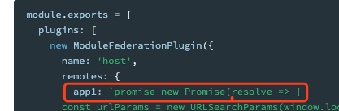

# 模块联邦

## 概念

### 底层概念

区分**本地模块** 和 **远程模块**。

本地模块为当前构建的一部分。

远程模块不参与当前构建，运行时从**容器**加载

加载远程模块被认为是异步操作。

容器可以嵌套使用，容器可以使用来自其他容器的模块。容器之间也可以循环依赖。


### 高级概念

每个构建都充当一个**容器**，也可将其他构建作为容器。

**共享模块**是指既可重写的又可作为向嵌套容器提供重写的模块。

**packageName **选项允许通过设置包名来查找所需的版本。


### 构建块

`ModuleFederationPlugin` 组合了两个底层API `ContainerPlugin` 和 `ContainerReferencePlugin`


### 用例

官方提供两个用例场景`每个页面单独构建 `和`将组件库作为容器`


### 动态远程容器

你可以通过动态加载的方式，提供一个共享模块的不同版本，从而实现 A/B 测试。


### 基于 Promise 的动态 Remote





`app1`值可以传递一个**promise**。

其**resolve**一个带有`get/init`API的对象。

场景：通过URL参数来决定联邦模块的加载。


### 动态 Public Path

可以允许 host 在运行时通过**公开远程模块的方法**来设置远程模块的 publicPath。

当你在 host 域的子路径上**挂载独立部署的子应用程序**时，这种方法特别有用。

通过设置`__webpack_public_path__` 来动态改变当前构建的Public Path。

`document.currentScript.src`能在运行时从`Script`标签推断出publicPath。

`output.publicPath`配置为`auto`，它将自动决定一个publicPath。


## API

### 指定依赖版本号

#### 通常有是3种指定方式

```js
plugins: [
    new ModuleFederationPlugin({
      // 方法一：数组
      // 添加 lodash 作为共享模块
      // 版本号自动从package.json中推断出来
      // 它对版本号没有必须检查
      // 因此它通常使用的高版本
      shared: ['lodash'],
      
      // 方法二：对象
      shared: {
        // 版本号自动从package.json中推断出来
        // 它将使用loadsh目前最高的版本，不超过5并且大于4.17
        lodash: '^4.17.0',
      }
      
      // 方法三：详细配置共享（sharing hints）
      shared: {
        react: {
          requiredVersion: deps.lodash,
          singleton: true,
        },
      },
    }),
  ],
};
```


#### Sharing hints配置

1. eager（boolen）
2. import （false | string）：提供的模块应放在共享范围内。 如果在共享范围或版本中未找到共享模块，则提供的模块也充当后退模块。 （此提示的值默认为属性名称。）
3. packageName
4. requiredVersion（false | string）：必须的版本号，例：^1.0.0
5. shareKey
6. shareScope
7. singleton：在共享范围内作为一个单例模块。
8. strictVersion：此提示允许webpack在版本无效时拒绝共享模块(当本地回退模块可用且共享模块不是一个单例时默认为true，否则为false，如果没有指定所需的版本则无效)。
9. version（false | string）：提供的模块的版本


## 理解

### 代码共享

```
federated code 可以总是加载自己的依赖，但在下载前会去尝试使用消费者的依赖。
```


### 无代码冗余

```
这里几乎没有任何依赖冗余，通过 shared 选项 —— remotes 将会首先依赖来自 host 的依赖，如果 host 没有依赖，它将会下载自己的依赖。没有代码层面的冗余，而只有内置的冗余。
```


### 服务端渲染

```
“Module Federation 当然也适用于 target: "node"，这里使用指向其他微前端应用的文件路径，而不是 URLs。这样的话你就可以用同样的代码，外加不一样的 Webpack 配置来在 Node.js 中实现 SSR. Module Federation 的特性在 Node.js 中保持不变，如独立构建、独立部署。—— Tobias Koppers

实现方法：S3 Streaming、ESI、自动化一个 npm 发布去消费服务器的变化内容等
```

