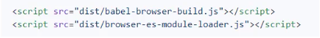

## 模块化的演进过程 

<h4>早期没有工具和规范的情况下</h4>

主要通过通过`Script`标签手动加载模块，经过3个阶段的演变

> Stage 1 - 基于文件划分的方式

污染全局作用域  
命名冲突问题  
无法管理模块依赖关系  
模块化完全依靠约定  

> Stage 2 - 命名空间方式  

减小命名冲突的可能  

> Stage 3 - IIFE 立即执行函数 

解决命名冲突，实现私有成员  

<h4>模块化规范的出现</h4>

> AMD规范 

`require.js`库实现了`AMD`规范

1. 目前绝大多数第三方库都支持`AMD`规范
2. AMD使用起来相对复杂
3. 模块JS文件请求频繁

同期出现的由淘宝推出的`seajs`库提出的`CMD`规范

> CommonJs规范  

以同步模式加载模块，程序启动时加载模块  
NodeJS内置模块系统规范

1. 一个文件就是一个模块
2. 每个模块都有单独的作用域
3. 通过module.exports导出成员
4. 通过require函数载入模块
5. 导出的是值的浅拷贝

> 模块化标准规范  

浏览器中遵循`ES Modules`规范，NodeJS环境中遵循`CommonJs`规范  

## ES Modules (ESM)

通过对`Script`标签增加`type = module`的属性，就可以以`ES Module`方式执行

<h4>基本特性</h4>

1. 自动采用严格模式
2. 每个`ESM`运行在单独的私有作用域中
3. `ESM`的`src`是通过`CORS`的方式请求外部JS模块（服务端必须支持CORS）
4. `ESM`的`Script`标签会延迟执行脚本（类似`defer`属性）
5. 多个`ESM`依次加载，且等到上个`ESM`加载执行完毕  

<h4>导入、导出注意事项</h4>

1. 导入时的`import {} from` 方式实际不是`解构`，是一种特定的语法
2. export单独使用时，后面必须跟着`{ }`，此时并不意味着是导出`一个对象`  
3. 导出对象使用`export default`  
4. 导出成员时，导出的是这个成员的`引用`，在其它模块`import`导入时，拿到的是这个成员引用（并非复制，共享内存空间），但是这个引用关系是`只读的`
5. 原生`ESM`不支持省略`扩展名`，和省略`index.js`，这是打包工具做的工作    
6. 支持动态`import()`  
7. 支持`export { } from './xx'`语法，常用在相同目录下模块通过`index.js`统一导出的情况

<h4>浏览器环境Polyfill</h4>

`browser-es-module-loader`配合`babel-browser-build`，浏览器直接引入使用 



script 标签`nomodule`属性用于识别不支持`ESM`的浏览器，且执行包含的代码

<h4>Nodejs环境的ESM</h4>

原生使用

1. Nodejs版本`>8.5`后原生支持`ESM`   
2. 文件后缀名为`mjs`  
3. 启动node时加上 `--experimental-modules`参数
4. `ESM`中可以导入`CommonJs`模块，反之不行
5. 不支持`require`、`module`、`exports`、`__filename`、`__dirname`等`CommonJs`中的模块（伪）全局成员，在`ESM`中通过以下方式

```
import { fileURLToPath } from 'url';
import { dirname } from 'path';

const __filename = fileURLToPath(import.meta.url);
const __dirname = dirname(__filename)
```

6. node新版本支持在`package.json`新增`type： module`属性来将`js`文件的默认模块方式改为`ESM`，要使用`CommonJS`则改为`cjs`后缀
7. 使用`babel、@babel/node、@babel/preset-env`对低版本Node进行兼容