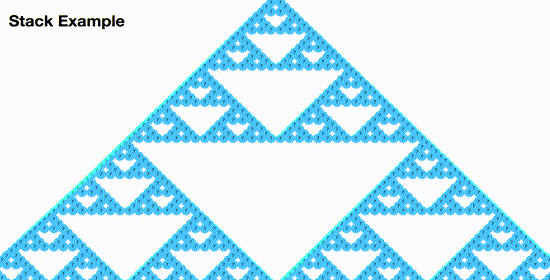
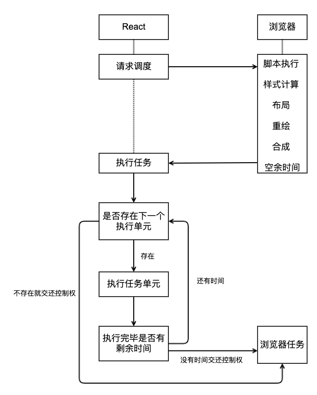

#### 1. Fiber 出现的目的是什么

为了提高 React 渲染页面的效率，减少页面卡顿，提升用户体验。




#### 2. 在 Fiber 出现之前 React 存在什么问题

在 React 15 版本中采用的是 Virtual DOM 对比方案，通过对比 Virtual DOM 找出差异部分，从而只将差异部分更新到页面中，避免更新整体 DOM 以提高性能。

```html
<body>
  <ul id="list"></ul>
  <button id="btn">更改数据</button>
</body>
<script>
  let data = ["a", "b", "c", "d", "e"]
  let list = document.getElementById("list")
  let btn = document.getElementById("btn")

  function renderData() {
    let str = ""
    for (let attr in data) {
      str += "<li>" + data[attr] + "</li>"
    }
    list.innerHTML = str
  }
  renderData()

  btn.onclick = function () {
    data[1] = "哈喽 摩托"
    renderData()
  }
</script>
```

在 Virtual DOM 比对的过程中 React 使用了递归，递归调用的过程不能被终止，如果 Virtual DOM 的层级比较深，递归比对的过程就会长期占用主线程，而 JavaScript 又是单线程，不能同时执行多个任务，其他任务只能等待执行，而且 JavaScript 的执行和 UI 的渲染又是互斥的，此时用户要么看到的就是空白界面，要么就是有界面但是不能响应用户操作，处于卡顿状态，用户体验差。

核心就是递归比对的过程长期占用主线程产生了性能问题。


<video controls>
  <source src="./video/Recursion.mp4" type="video/mp4">
</video>


#### 3. 虚拟 DOM 是如何被转换为真实 DOM 的

[babel repl](https://babeljs.io/repl)

```react
const jsx = (
  <div id="a1">
    <div id="b1">
      <div id="c1"></div>
      <div id="c2"></div>
    </div>
    <div id="b2"></div>
  </div>
)
```

```react
function render(vdom, container) {
  // 创建 DOM 元素
  const element = document.createElement(vdom.type)
  // 为元素添加属性 (刨除 children)
  Object.keys(vdom.props)
    .filter(propName => propName !== "children")
    .forEach(propName => (element[propName] = vdom.props[propName]))

  // 递归创建子元素
  if (Array.isArray(vdom.props.children)) {
    vdom.props.children.forEach(child => render(child, element))
  }
  // 将子元素追加到父级
  container.appendChild(element)
}

render(jsx, document.getElementById("root"))
```

#### 4. Fiber 如何解决性能问题

在 Fiber 架构中 React 放弃了递归调用，采用循环来模拟递归，因为循环可以随时被中断。

React 利用浏览器空闲时间执行比对任务， 解决了 React 执行比对任务长期占用主线程的问题。

React 在执行完一个任务单元后，查看是否有其他的高优先级任务，如果有，放弃占用主线程，先执行优先级高的任务。


#### 5. 什么是 Fiber

1. Fiber 是一个执行单元

   在 React 15 中，将 VirtualDOM 树整体看成一个任务进行递归处理，任务整体庞大执行耗时且不能中断。

   在 React 16 中，将整个任务拆分成了一个一个小的任务进行处理，每一个小的任务指的就是一个 Fiber 节点的构建。

   任务会在浏览器的空闲时间被执行，每个单元执行完成后，React 都会检查是否还有空余时间，如果有就交还主线程的控制权。

   

   1. 将任务拆分成了一个一个小的任务单元
   2. 闲时执行任务

2. Fiber 是一种数据结构

   Fiber 是一种数据结构，支撑 Fiber 构建任务的运转。 

   当某一个 Fiber 任务执行完成后，怎样去找下一个要执行的 Fiber 任务呢？

   React 通过链表结构找到下一个要执行的任务单元。

   要构建链表结构，需要知道每一个节点的父级节点是谁，要知道他的子级节点是谁，要知道他的下一个兄弟节点是谁。

   Fiber 其实就是 JavaScript 对象，在这个对象中有 child 属性表示节点的子节点，有 sibling 属性表示节点的下一个兄弟节点，有 return 属性表示节点的父级节点。
   
   ```javascript
   type Fiber = {
     // 组件类型 div、span、组件构造函数
     type: any,
     // DOM 对象
     stateNode: any,  
     // 指向自己的父级 Fiber 对象
     return: Fiber | null,
     // 指向自己的第一个子级 Fiber 对象
     child: Fiber | null,
     // 指向自己的下一个兄弟 iber 对象
     sibling: Fiber | null,
   };
   ```
   
   


#### 6. Fiber 的工作方式

Fiber 的工作分为两个阶段：render 阶段和 commit 阶段。

render 阶段：构建 Fiber 对象，构建链表，在链表中标记要执行的 DOM 操作 ，可中断。

commit 阶段：根据构建好的链表进行 DOM 操作，不可中断。


先从上向下走，构建节点对应的 Fiber 对象，然后再从下向上走，构建 Fiber 对象及链表。

#### 7. 实现 Fiber

```react
import React from "react"

const jsx = (
  <div id="a1">
    <div id="b1">
      <div id="c1"></div>
      <div id="c2"></div>
    </div>
    <div id="b2"></div>
  </div>
)

const container = document.getElementById("root")

/**
 * 1. 为每一个节点构建 Fiber 对象
 * 2. 构建 Fiber 链表
 * 3. 提交 Fiber 链接
 */

// 创建根元素 Fiber 对象
const workInProgressRoot = {
  stateNode: container,
  props: {
    children: [jsx]
  }
}

let nextUnitOfWork = workInProgressRoot

function workLoop(deadline) {
  // 如果下一个要构建的执行单元存在并且浏览器有空余时间
  while (nextUnitOfWork && deadline.timeRemaining() > 0) {
    // 构建执行单元并返回新的执行单元
    nextUnitOfWork = performUnitOfWork(nextUnitOfWork)
  }
  // 如果所有的执行单元都已经构建完成
  if (!nextUnitOfWork) {
    // 进入到第二个阶段 执行 DOM 操作
    commitRoot()
  }
}
// Fiber 工作的第一个阶段
function performUnitOfWork(workInProgress) {
  // 构建阶段向下走的过程
  // 1. 创建当前 Fiber 节点的 DOM 对象并存储在 stateNode 属性中
  // 2. 构建子级 Fiber 对象
  beginWork(workInProgress)
  // 如果子级存在
  if (workInProgress.child) {
    // 返回子级 构建子级的子级
    return workInProgress.child
  }
  // 开始构建阶段向上走的过程
  // 如果父级存在
  while (workInProgress) {
    // 构建 Fiber 链表
    completeUnitOfWork(workInProgress)
    // 如果同级存在
    if (workInProgress.sibling) {
      // 返回同级 构建同级的子级
      return workInProgress.sibling
    }
    // 同级不存在 退回父级 看父级是否有同级
    workInProgress = workInProgress.return
  }
}

function beginWork(workInProgress) {
  // 如果 Fiber 对象没有存储其对应的 DOM 对象
  if (!workInProgress.stateNode) {
    // 创建 DOM 对象并存储在 Fiber 对象中
    workInProgress.stateNode = document.createElement(workInProgress.type)
    // 为 DOM 对象添加属性
    for (let attr in workInProgress.props) {
      if (attr !== "children") {
        workInProgress.stateNode[attr] = workInProgress.props[attr]
      }
    }
  }
  // 创建子级 Fiber 对象
  if (Array.isArray(workInProgress.props.children)) {
    // 记录上一次创建的子级 Fiber 对象
    let previousFiber = null
    // 遍历子级
    workInProgress.props.children.forEach((child, index) => {
      // 创建子级 Fiber 对象
      let childFiber = {
        type: child.type,
        props: child.props,
        return: workInProgress,
        effectTag: "PLACEMENT"
      }
      // 第一个子级挂载到父级的 child 属性中
      if (index === 0) {
        workInProgress.child = childFiber
      } else {
        // 其他子级挂载到自己的上一个兄弟的 sibling 属性中
        previousFiber.sibling = childFiber
      }
      // 更新上一个子级
      previousFiber = childFiber
    })
  }
}

function completeUnitOfWork(workInProgress) {
  let returnFiber = workInProgress.return

  if (returnFiber) {
    // 链头上移
    if (!returnFiber.firstEffect) {
      returnFiber.firstEffect = workInProgress.firstEffect
    }
    // lastEffect 上移
    if (!returnFiber.lastEffect) {
      returnFiber.lastEffect = workInProgress.lastEffect
    }
    // 构建链表
    if (workInProgress.effectTag) {
      if (returnFiber.lastEffect) {
        returnFiber.lastEffect.nextEffect = workInProgress
      } else {
        returnFiber.firstEffect = workInProgress
      }
      returnFiber.lastEffect = workInProgress
    }
  }
}

// Fiber 工作的第二阶段
function commitRoot() {
  // 获取链表中第一个要执行的 DOM 操作
  let currentFiber = workInProgressRoot.firstEffect
  // 判断要执行 DOM 操作的 Fiber 对象是否存在
  while (currentFiber) {
    // 执行 DOM 操作
    currentFiber.return.stateNode.appendChild(currentFiber.stateNode)
    // 从链表中取出下一个要执行 DOM 操作的 Fiber 对象
    currentFiber = currentFiber.nextEffect
  }
}

// 在浏览器空闲的时候开始构建
requestIdleCallback(workLoop)
```

#### 8. 构建 Fiber 链表

1. 什么是链表

   

   通过链表可以按照顺序存储内容

2. 链表的构建顺序是怎么样的 ？

   链表的顺序是由 DOM 操作的顺序决定的，c1 是第一个要执行 DOM 操作的所以它是链的开始，A1 是最后一个被添加到 Root 中的元素，所以它是链的最后。

   

3. 如何向链的尾部添加新元素？

   在链表结构中通过 nextEffect 存储链中的下一项。

   在构建链表的过程中，需要通过一个变量存储链表中的最新项，每次添加新项时都使用这个变量，每次操作完成后都需要更新它。这个变量在源码中叫做 lastEffect。

   lastEffect 是存储在当前 Fiber 对象的父级上的，当父级发生变化时，为避免链接顺序发生错乱，lastEffect 要先上移然后再追加nextEffect

4. 将链表保存在什么位置？

   链表需要被保存在 Root 中，因为在进入到第二阶段时，也就是 commitRoot 方法中，是将 Root 提交到第二阶段的。 

   在源码中，Root Fiber 下有一个叫 firstEffect 的属性，用于存储链表。

   在构建链表的遍历过程中，C1 开始，Root 是结尾，如何才能将 C1 存储到 Root 中呢？

   其实是链头的不断上移做到的。

   

   

