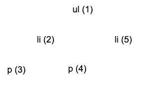
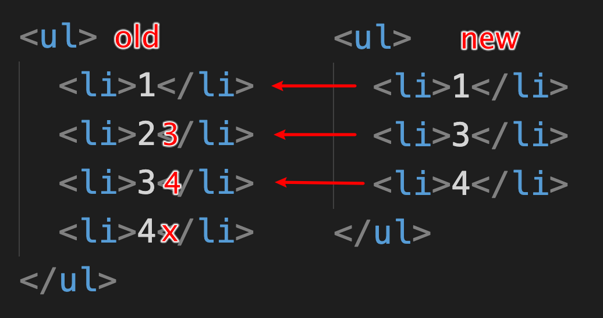

# Virtual DOM 及 Diff 算法


## JSX 到底是什么

在 React 代码执行之前，Babel 会对将 JSX 编译为 React API。

```react
<div className="container">
  <h3>Hello React</h3>
  <p>React is great </p>
</div>
```

```react
React.createElement(
  "div",
  {
    className: "container"
  },
  React.createElement("h3", null, "Hello React"),
  React.createElement("p", null, "React is great")
);
```

[Babel REPL 在线 JSX 转换](https://babeljs.io/repl) 


## Virtual DOM

在 React 中，每个 DOM 对象都有一个对应的 Virtual DOM 对象，它是 DOM 对象的 JavaScript 对象表现形式。

```react
<div className="container">
  <h3>Hello React</h3>
  <p>React is great </p>
</div>
```

```react
{
  type: "div",
  props: { className: "container" },
  children: [
    {
      type: "h3",
      props: null,
      children: [
        {
          type: "text",
          props: {
            textContent: "Hello React"
          }
        }
      ]
    },
    {
      type: "p",
      props: null,
      children: [
        {
          type: "text",
          props: {
            textContent: "React is great"
          }
        }
      ]
    }
  ]
}
```

React Virtual DOM 注意点：

1. 文本节点存储在 `props.textContent`  中。

2. `props` 属性里存储了一份 当前节点子节点的 `children` 拷贝。

3. 当文本节点值为 `boolean` 类型 或 `null` 时，将移除该文本节点。

   例如：

   ```react
   {2 == 1 && <div>如果2和1相等渲染当前内容</div>}
   ```


## 渲染组件 

组件的 Virtual DOM **type** 值为函数，函数组件和类组件都是这样的。

```json
{
  type: f function() {},
  props: {}
  children: []
}
```

而区分  **类组件**，可通过判断 `virtualDOM.type`  原型上是否存在 `render`方法。


## Virtual DOM 比对

通过 **首次** 创建真实DOM对象时，把 Virtual DOM 对象添加到对应DOM对象的`_virtualDOM` 属性中，从而再更新时拿到上一次的Virtual DOM 对象。

```react
import mountElement from "./mountElement"

export default function mountNativeElement(virtualDOM, container) {
  // 将 Virtual DOM 挂载到真实 DOM 对象的属性中 方便在对比时获取其 Virtual DOM
  newElement._virtualDOM = virtualDOM
}
```

React 16 之前，React组件都必须被包裹在一个元素内部这一特性。

因此，每次重新render时，其 `container.firstChild `  上就存储着上一次的 `Virtual DOM` 对象。


Virtual DOM 对比时是采用同级比对：


且比对时采用 **深度优先** 的比对顺序（子节点优先于同级节点）：



### Virtual DOM 类型相同

Virtual DOM 类型相同，如果是元素节点，就对比元素节点属性是否发生变化，如果是文本节点就对比文本节点内容是否发生变化。


###  Virtual DOM 类型不同

当对比的元素节点类型不同时，就不需要继续对比了，直接使用新的 Virtual DOM 创建 DOM 对象，用新的 DOM 对象直接替换旧的 DOM 对象。当前这种情况要将 **组件除外**，组件要被单独处理。


### 删除节点

删除节点发生在 **节点更新以后** 并且发生在 **同一个父节点下的所有子节点** 身上。

在节点更新完成以后，如果 **旧节点对象的数量多于** 新 VirtualDOM 节点的数量，就说明有节点 **需要被删除** 。




### 类组件状态更新

首先类组件 `Component` 基础类需要实现 `setState` 方法：

```react
setState(state) {
  this.state = Object.assign({}, this.state, state);
}
```


然后通过调用`this.render()`方法拿到最新的 `VirtualDOM` 与 `old VirtualDOM` 调用 `diif` 方法进行对比更新：

```react
 setState(state) {
  this.state = Object.assign({}, this.state, state);
  let newVirtualDOM = this.render();
  let oldDOM = this.getDOM();
  diff(newVirtualDOM, oldDOM.parentNode, oldDOM);
}
```


通过类方法 `setDOM` 和 `getDOM` 设置、获取类组件当前（旧）的DOM。

**setDOM 调用时机** 在类组件返回 `VirtualDOM` 时，将类的实例添加到 `VirtualDOM.component` 属性上保存。

而在 `mountNativeElement` 方法挂载类组件所对应的DOM节点时，可以调用 `setDOM` 存储DOM。

```react
export default function mountNativeElement(virtualDOM, container) {
  let newElement = createDOMElement(virtualDOM)
  container.appendChild(newElement);

  let component = virtualDOM.component;
  if (component) {
    component.setDOM(newElement)
  }
}
```


### 组件更新

在 diff 方法中判断要更新的 Virtual DOM 是否是组件。

再判断要更新的组件和未更新前的组件 **是否是同一个组件**。


#### 不是同一组件

直接调用 mountElement 方法将组件返回的 Virtual DOM 添加到页面中，**同时需要删除旧的组件节点** 。


#### 同一组件

执行更新组件操作，其实就是将最新的 props 传递到组件中，再调用组件的render方法获取组件返回的最新的 Virtual DOM 对象，再将 Virtual DOM 对象传递给 diff 方法，让 diff 方法找出差异，从而将差异更新到真实 DOM 对象中。

