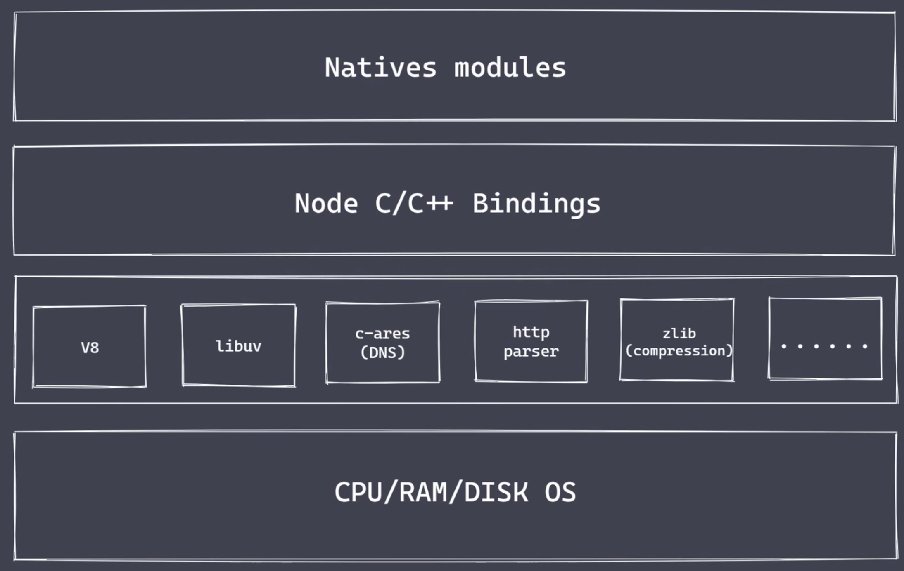
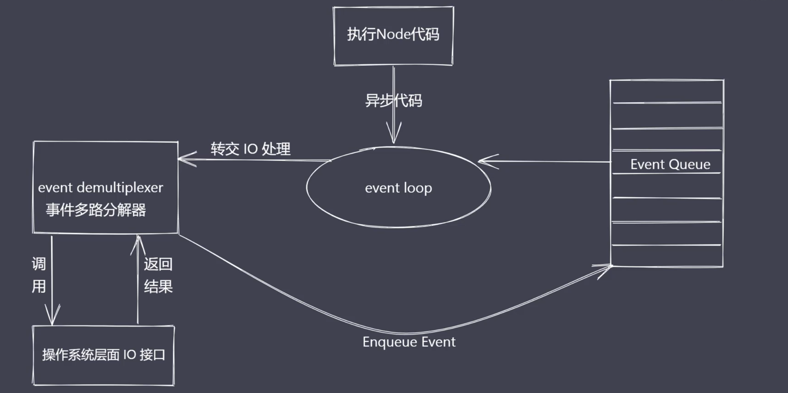

# Nodejs基础

## Nodejs架构



### Natives modules

- 当前层内容由JS实现。
- 提供应用程序可直接调用库，例如`fs`、`path`、`http`等。

### Builtin modules “胶水层”

- 由于JS语言无法直接操作底层硬件设置，图中使用`Node C/C++ Bindings`进行表示。
- 当前层内容主要用 C/C++ 进行编写。例如`socket`、`http`等。

### 底层

- V8：执行JS代码，提供桥梁接口。
- Libuv：事件循环、事件队列、异步IO。
- 第三方模块：zlib、http、c-ares（DNS）等。

## Why Nodejs

**Reactor**模式，单线程完成多线程工作。
Nodejs更适用于**IO密集型高并发请求**。

## 异步IO

阻塞IO、非阻塞IO

实现异步IO的过程：



- IO是应用那个程序的瓶颈所在。
- 异步IO提高性能采原地等待结果返回。
- IO操作属于操作系统级别，平台都有对应数显。
- Nodejs单线程配合时间驱动架构及libuv实现了异步IO

## 事件驱动架构

事件驱动架构是**软件开发**中的通用模式。

事件驱动、发布订阅、观察者共同特征：**主体发布消息，其它实例接收消息。**

## Nodejs单线程

单线程如何实现高并发？**异步非阻塞IO配合事件回调通知**
Nodej的单线程主要指的是运行代码的**主线程**是单线程，**Libuv**是支持多线程的。

## 应用场景 

适用于：IO密集型的高并发请求，例如**中间层**、**操作数据库提供API服务**、**实时的聊天应用**。
不适用于：处理大量的**业务逻辑**。

## 全局对象、变量

### 常见全局变量

- __filename：返回正在执行脚本文件的绝对路径。
- __dirname：返回正在执行脚本的所在目录。
- timer类函数：执行顺序与事件循环间的关系。
- process：提供与当前进程互动的接口。
```js
// 1. 内存
console.log(process.memoryUsage());
{
  rss: 18644992,         // 常驻内存
  heapTotal: 4333568,    // 申请的总内存大小
  heapUsed：2396032,     // 程序执行实际所使用的内存大小
  external：826544,      // 底层C/C++核心模块占用内存大小
  arrayBuffers：9386     // 缓冲区空间大小
}

// 2. cpu
process.cpuUsage();

// 3. 运行环境
//    运行目录
process.cwd();
//    node环境
process.version / process.versions;
//    cpu架构
process.arch;
//    用户环境
process.env;
//    系统平台
process.platform;

// 4. 运行状态
//    启动参数
process.argv;
//    PID
process.pid;
//    运行时间
process.uptime();

// 5. 事件
process.on('exit', (code) => {})
process.on('beforeExit', (code) => {})

// 6. 退出
process.exit();

// 7. 标准输出 输入 错误
process.stdout.write();
process.stdin.pipe(process.stdout);
process.stdin.on('readble', () => {
  let chunk = process.stdin.read();
}));
```
- require：实现模块的加载。
- module、exports：处理模块的导出
