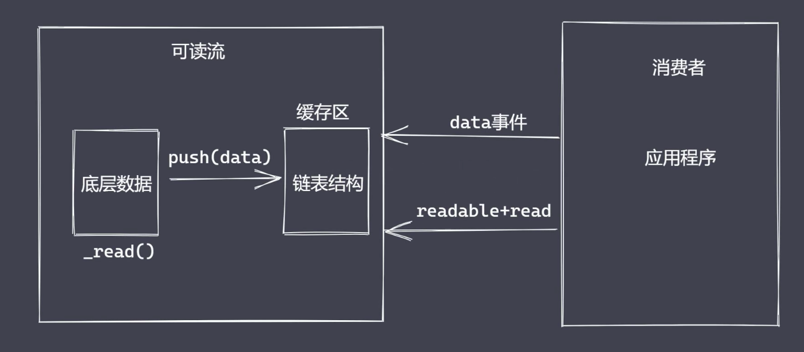
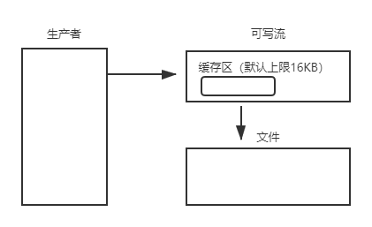

# Stream 模块

Nodejs中的 **stream** 就是处理流式数据要的抽象接口集合。
Nodejs中处理数据的模块例`fs`等都继承了`Stream`和`EventEmitter`。

## 流的优势

时间效率：流的分段处理可以同时操作多个数据chunk。
空间效率：同一时间流无须占据大内存空间。
使用方便：流配合管道，扩展程序变得简单。

## Node流特点

Stream 模块实现了四个具体的抽象。
所有流都继承自 **EventEmitter**。

## Node中流的分类

可读、可写、双工、转换是单一抽象具体实现。

### Readable

**可读流**，能够实现数据的读取。
生产供程序消费数据的流。

#### 自定义可读流



自定义步骤：

1. 继承 stream 里的 `Readable` 类。
2. 重写 `_read` 方法调用 `push` 产出数据添加到缓冲区。
3. 消费者通过`readable`、`data`事件监听进行消费。

```js
const { Readable } = require("stream");

let source = ["a", "b", "c"];

class CusReadable extends Readable {
  constructor() {
    super();
    this.source = source;
  }

  _read() {
    let data = this.source.shift() || null;
    this.push(data);
  }
}

let c = new CusReadable();

c.on("readable", () => {
  let data = null;
  while ((data = c.read()) !== null) {
    process.stdout.write(data.toString()); // abc
  }
});

c.on("data", (chunk) => {
  process.stdout.write(chunk.toString());  // abc
});
```

### Writeable 

**可写流**，能够实现数据的写操作。
用于消费数据的流。

#### 自定义可写流

1. 继承 stream 里的 `Writeable`类。
2. 重写 `_write` 方法调用`write`执行写入。

```js
const { Writable } = require("stream");
const fs = require("fs");

const f = fs.createWriteStream("./data.copy.txt");

class CusWritable extends Writable {
  constructor() {
    super();
  }

  _write(chunk, encoding, callback) {
    f.write(chunk, encoding);
    process.nextTick(callback);
  }
}

let c = new CusWritable();

c.write("a", "utf-8", () => {
  console.log("end");
});
```

##### 可写流事件

pipe事件：可读流调用`pipe()`方法时触发。
unpipe事件：可读流调用`unpipe()`方法时触发。

### Duplex

**双工流**，既可读又可写。
既能成产又能消费，但 **两者独立**。

#### 自定义双工流

1. 继承 `Duplex`类。
2. 重写 `_read`方法，调用`push`生产数据。
3. 重写 `write`方法，调用`write`消费数据。

```js
const { Duplex } = require("stream");
const source = ["a", "b", "c"];

class CusDuplex extends Duplex {
  constructor() {
    super();
    this.source = source;
  }

  _read() {
    let data = this.source.shift() || null;
    this.push(data);
  }

  _write(chunk, encoding, callback) {
    process.stdout.write(chunk);
    process.nextTick(callback);
  }
}

let c = new CusDuplex();

c.on("data", (chunk) => {
  console.log(chunk.toString());
});
c.write("数据测试", "utf-8", () => {
  console.log("end");
});
```

### Transform

**转换流**，可读可写，还能实现数据转换。**也是一个双工流。**
**可读与可写流打通。**

#### 自定义转换流

1. 继承 `Transform`类。
2. 重写 `_transoform`方法，调用`push`和`callback`。
3. 重写 `_flush`方法，处理剩余数据（非必须）。

```js
const { Transform } = require('stream');

class CusTransform extends Transform {
  constructor() {
    super();
  }

  _transform(chunk, encoding, callback) {
    this.push(chunk.toString().toUpperCase());
    callback(null)
  }
}

const c = new CusTransform();
c.write('a');
c.write('b');
c.end('c')

c.pipe(process.stdout); // ABC
```

## 文件读写流

### 可写流执行流程



```js
const fs = require("fs");

let ws = fs.createWriteStream('test.txt', {
  highWaterMark: 3
})
let flag;

flag = ws.write('1');      // true
flag = ws.write('2');      // true
flag = ws.write('3');      // false

ws.on('drain', () => {
  console.log('1)
})
```

1. 第一次调用`write`方法时是将数据直接写入到文件中。
2. 第二次调用`write`方法时将数据写入至缓存区中。
3. **生产速度** 和 **消费速度**是不一样的，一般情况下生产比消费快得多。
4. 当 `flag` 为 `false` 之后并不阻止当次数据写入。表明消费速度跟不上生产速度了，一般这个时候将可读流的模块修改为**暂停模式**。
5. 当数据生产者暂停后，消费则会慢慢消费它内部缓存中的数据，直到可以再次被执行写入操作。
6. 当缓冲区就可以继续写入数据时，通过`drain`事件通知生产者。


### 控制写入速度

**drain** 事件的使用，`pipe`管道的内部实现机制。

```js
const fs = require("fs");

const ws = fs.createWriteStream("./test.txt", {
  highWaterMark: 3,
});

const source = ["1", "2", "3", "4"];
let num = 0;
let flag = true;

const executeWrite = () => {
  while (num !== source.length && flag) {
    flag = ws.write(source[num]);
    num++;
  }
};

ws.on("drain", () => {
  flag = true;
  executeWrite();
});

executeWrite();
```

## 背压机制

即 **pipe** 实现原理。
Nodejs的stream已实现 **背压机制**。

### 数据读写问题

```js
const fs = require("fs");

const rs = fs.createReadStream('./demo.txt', {
  hightWaterMark: 4
});

const ws = fs.createWriteStream('./demo.cp.txt', {
  hightWaterMark: 1
});

rs.pipe(ws);
```

## 链表结构

在文件可写流`write`方法工作时，有些即将被写入的内容需要在 **缓冲区** 排队等待，且遵循 **先进先出** 规则。
Node使用 **链表** 的方式来实现 **队列** 以储存这些等待被写入的数据。

### 为什么不采用数组

1. 数组存储数据的长度具有上线，**2^32-1长度**。
2. 数组在插入、删除元素时要移动其它元素，消耗要大一些。
3. JS 中数组被实现为对象，使用效率相对会低一些。