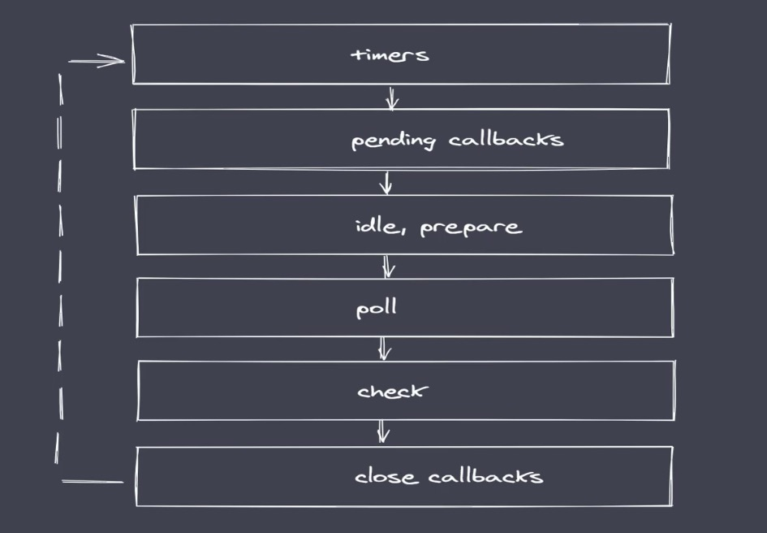

# 事件模块

## evnets 与 EventEmitter

nodejs是基于事件驱动的异步操作架构，内置`events`模块。
events模块提供了`EventEmitter`类。
nodejs中有很多内置核心模块继承了`EventEmitter`。

## 事件循环

### 浏览器

#### 事件队列

- 宏任务队列
- 微任务队列

#### 完整事件循环执行顺序

1. 从上至下执行所有**同步代码**。
2. 执行过程中遇到的宏任务与微任务添加至相应的**任务队列**。
3. 同步代码执行完毕后，执行满足条件的微任务回调。
4. 微任务队列执行完毕后执行所有满足需求的宏任务回调。
5. 循环事件操作。

**每执行一个宏任务之后就会立刻检查微任务队列**

### Nodejs

#### 任务队列



- timers：执行`setTimeout`与`setInterval`回调。
- pending calbacks：执行系统操作的回调，例如`tcp`、`udp`。
- idle，prepare：只在系统内部进行使用。
- poll：执行与`I/O`相关的回调。
- check：执行`setImmediate`中的回调。
- close callbacks：执行`close事件`的回调。

#### 完整事件循环

1. 执行同步代码，将不同的任务添加至相应的队列中。
2. 所有同步代码执行后去执行满足条件的微任务。
3. 所有微任务代码执行后会执行`timer`队列中满足的宏任务。
4. timer中执行完一个宏任务后就会检查并执行微任务，微任务清空后继续执行宏任务。清空`timer`后切换至`pending callback`队列。
5. 循环事件操作。

注：微任务中，`process.nextTick` 优先级高于 `Promise`


### Nodejs 与 浏览器事件循环的区别

####  任务队列数不同

- 浏览器只有两个任务队列：宏、微
- NodeJS中有6个事件队列

#### Nodejs微任务执行时机不同

- 浏览器每当一个宏任务执行完毕后就清空微任务
- Nodejs平台在事件队列切换时才会去清空微任务

#### 微任务优先级不同

- 浏览器中，微任务满足`先进先出`的规则。
- Node中`process.nextTick`优先于`Promise.then`执行。 同类型依然满足`先进先出`规则。

### Nodejs 常见问题

#### setTimeout(0) 与 setImmediate 

不稳定的输出结果：

```js
setTimeout(() => {
 console.log('1')
}, 0)

setImmediate(() => {
  console.log('2')
})

// 可能是打印：1、2
// 也可能是打印：2、1
```

原因：`setTimeout(0)`中的`0`在浏览器或Node平台下都有一些*不稳定的因素*，会导致延而优先执行了`setImmediate`

保持结果稳定：

```js
fs.readFile('./m.js', () => {
  setTimeout(() => {
    console.log('1')
  }, 0)

  setImmediate(() => {
    console.log('2')
  })
})

// 稳定打印：2、1
```

原因：将其执行顺序包裹于`IO`中，`IO`任务添加至`poll`队列，而且根据Nodejs任务队列切换顺序，想下一定优先执行`check队列`，因此`setImmediate`一定优先执行与`timer队列`中的`setTimeout`