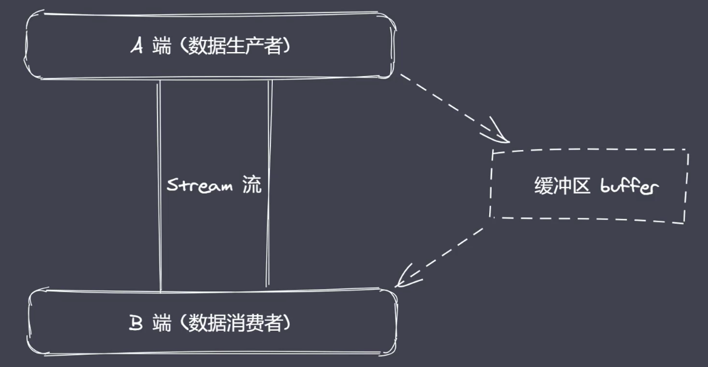
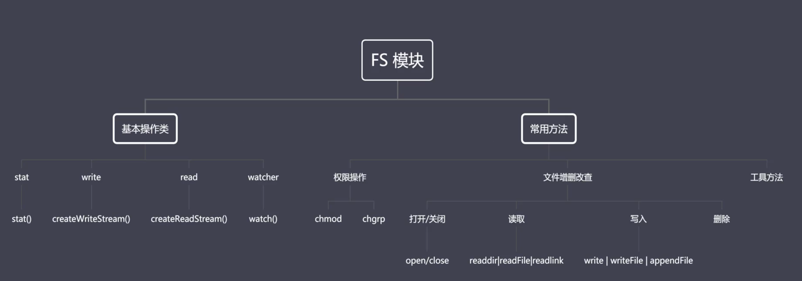

# 核心模块

## path

内置模块，用于处理文件/目录的路径。

### 常用API

#### basename()

获取基础名称

- 返回接收路径的最后一部分
- 第二个参数表示扩展名，如果没有设置则返回完整的文件名称带后缀
- 第二个参数作为后缀时，如果没有在当前路径中被匹配到，则会被忽略
- 处理目录路径的时候，如果结尾处有路径分隔符，则会被忽略

#### dirname()

获取目录名称

- 返回路径中最后一个部分的上一层目录所在绝对路径

#### extname()

获取扩展名称

- 返回path路径中相应文件的后缀名
- 如果path路径中存在多个点，匹配最后个点到结尾的位置

#### isAbsolute()

判断是否为绝对路径

#### join()

拼接多个路径片段

#### resolve()

返回绝对路径
#### parse()

解析路径

- 接收一个路径，返回一个对象，包含不同的信息。
- root dir base ext name

#### format()

序列化路径
#### normalize()

规范化路径

## Buffer

全局变量；Buffer 缓冲区。  
**Buffer 让 JavaScript 可以操作二进制数据。**



### buffer相关概念

二进制数据：IO行为操作的就是二进制数据。
流操作：流操作配合管道实现数据的分段传输。
Buffer缓冲区：数据的端到端传输会有生产者和消费者，生产和消费的过程旺旺存在等待，等待时候的数据就存在**缓冲区**。

### NodeJS的Buffer总结：

**不占据V8堆内存大小** 的一片内存空间。
内存的使用由Node来控制，由V8的GC回收。
一般配合 **Stram**流使用，充当数据缓冲区。

### 创建Buffer

#### alloc：创建指定字节大小的buffer 

```js
// 创建10字节的buffer
const b = Buffer.alloc(10);
```

#### allocUnsafe：创建指定大小的buffer（不安全）

内存空间中空闲的空间就会被buffer来使用，但可能还会存在数据

#### from：接收数据，创建buffer

将内容转换成**16进制**进行存储。

```js
// 接收三种参数类
const b1 = Buffer.from('中');
b1.toString(); // 中
Buffer.from([0xe4, 0xb8, 0xad]);
Buffer.from(Buffer);
```

### 实例方法

#### fill

使用数据填充buffer。
使用目标数据 **循环填充** buffer，直到填满buffer

```js
let buf = Buffer.alloc(6);
buf.fill('123');
console.log(buf.toString()); // 123123
```

#### write

向buffer中写入数据。
不**循环填充**。

```js
write(value: number, start?:number, len?: number)
```

#### toString

从buffer中提取数据

```js

const buf = Buffer.from('我们的爱'); 
console.log(buf.toString('utf-8', 3, 9)); // 们的
```

#### slice

截取buffer

```js

const buf = Buffer.from('我们啊');
let b1 = buf.slice(-3);
console.log(b1.toString()); // 啊
```

#### indexOf

在buffer中查找数据

```js

const buf = Buffer.from('我和你，我们，我的，我大');
console.log(buf.indexOf('我'));      // 0
console.log(buf.indexOf('我', 2));   // 12
console.log(buf.indexOf('我大家'));  // - 1
```

#### copy

拷贝buffer中的数据

```js

let b1 = Buffer.alloc(6);
let b2 = Buffer.from('哈哈');

b2.copy(b1);
console.log(b1.toString()); // 哈哈
console.log(b2.toString()); // 哈哈
``` 

### 静态方法

#### concat

将多个buffer拼接成一个新的buffer

```js

let b1 = Buffer.from('吴心');
let b2 = Buffer.from('工作');

let b = Buffer.concat([b1, b2]);
console.log(b.toString()); // 吴心工作
```

#### isBuffer

判断当前数据是否为buffer

### 自定义buffer

#### 实现一个split

```js

ArrayBuffer.prototype.split = function(seq) {
  let len = Buffer.from(seq).length;
  let ret = [];
  let start = 0;
  let offset = 0;

  while(offset = this.indexOf(seq, start) !== -1) {
    ret.push(this.slice(start, offset));
    start = offset + len;
  }
  ret.push(this.slice(start));
  return ret;
}
```

## FS

提供文件系统操作的API 



### flag

表示对文件操作方式

- r：表示可读
- w: 表示可写
- s：表示同步
- +：表示执行相反操作
- x：表示排它操作
- a：表示追加操作

### fd

是操作系统分配给被打开文件的标识
