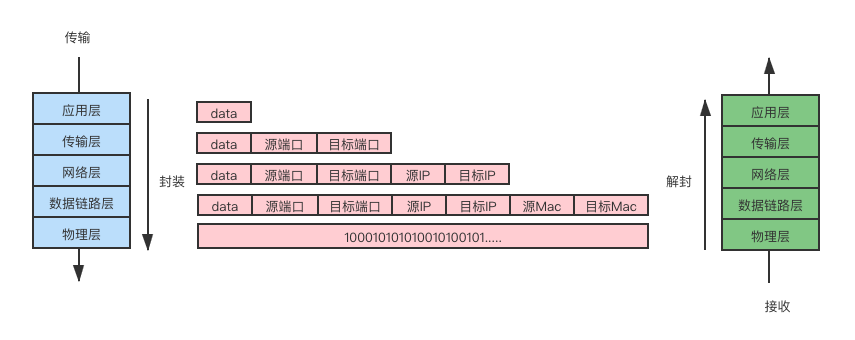
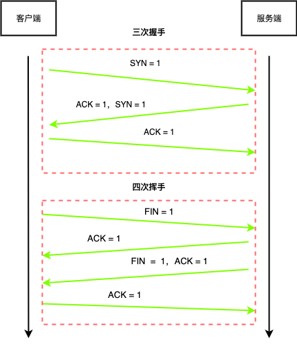

# 通信

## 网络通信基本原理

## 常见通讯方式

### 交换机通讯

通过交换机可以将多台电脑进行连接。
定位局域网中的其它主机。
通过**Mac地址**来唯一标识一台主机。

#### 不足

1. 交换机的接口数量有上线。
2. 局域网存在大量主机会造成 **广播风暴**。

### 路由器通讯

## 网络层次模型

### OSI 七层模型

- 应用层：用户与网络的接口。
- 表示层：数据加密、转换、压缩。
- 会话层：控制网络连接建立与终止。
- 传输层：控制数据传输可靠性。
- 网络层：确定目标网络。
- 数据链路层：确定目标主机。
- 物理层：各种物理设备和标准。

### TCP/IP 四层模型

在 **OSI** 基础上简化形成

- 应用层：合并OSI的`应用层`、`表示层`、`会话层`。
- 传输层
- 网络层
- 网络接口层：合并OSI的`数据链路层`、`物理层`。

## 数据封装与解封装

### 流程图

## TCP三次握手与四次挥手

### TCP协议

TCP输入传输层协议。
TCP是面向连接的协议。
TCP用于处理实时通信。

### 常见控制字段

**SYN = 1** 表示请求建立连接。
**FIN = 1** 表示请求断开连接。
**ACK = 1** 表示数据信息确认。

### 流程图 

## net 模块 

### 通信事件

net模块在通信的时间节点中一些常用的事件。

- listening事件：调用 **server.listen** 方法之后触发。
- connection事件：新的连接建立时触发。
- close事件：当**server**关闭时触发。
- error事件：当错误出现的时候触发。

当某个具体事件触发后，在数据传输中的一些常用事件和方法。

- data事件：当接收到数据的时候触发。
- write方法：在**socket**上发送数据，默认是**UTF8**编码。
- end方法：当**socket**的一端发送**FIN**包时触发，结束可读端。

## TCP数据粘包

### 粘包原因

通信通常包含数据 **发送端** 和 **接收端**，
发送端累计（缓冲区）数据统一发送，
接收端也是**缓冲**（缓冲区）数据之后再消费。

**TCP拥塞机制决定上述缓冲数据的发送时机**

### 解决方案

#### 增加时间间隔

例如使用`setTimeout`的方式增加客户端发送数据的时间间隔。缺点：降低了数据的传输效率。

#### 封包拆包

通讯双方约定以**某种自定义规则**将数据进行打包与拆包。