# 前端性能优化

[参考拉钩教育总结](https://www.yuque.com/books/share/bee30889-85b8-442e-be5c-6c683f783e2f/eos3ul)

从 “从浏览器输入URL到页面渲染” 这个经典面试题从前端发关注点切入，整个过程可以分为以下阶段：

1）浏览器接收到 URL，到网络请求线程的开启。

2）一个完整的 HTTP 请求并的发出。

3）服务器接收到请求并转到具体的处理后台。

4）前后台之间的 HTTP 交互和涉及的缓存机制。

5）浏览器接收到数据包后的关键渲染路径。

6）JS 引擎的解析过程。

## 网络请求线程开启

### 进程与线程

进程和线程的区别：

1. 只要某个线程执行出错，整个进程崩溃。
2. 进程之间相互隔离，保证其运行稳定性。同时提供 [IPC机制](https://en.wikipedia.org/wiki/Inter-process_communication) 进行进程间通讯。
3. 进程所占用资源会在进程结束后由操作系统回收。即使某个进程下的线程产生了内存泄漏，也会随之结束而被回收。
4. 线程之间可以共享 **所属进程** 的资源。 

### 单进程浏览器

单进程浏览器架构图：

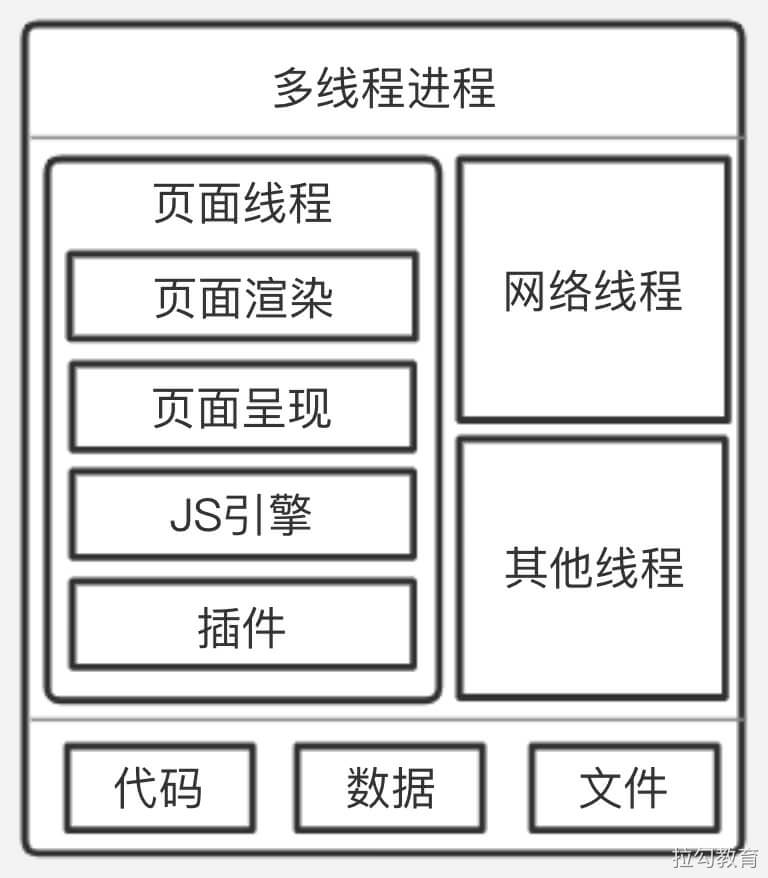

单进程存在的隐患：

1）流畅性较差

2）安全性较差

3）稳定性较差

### 多进程浏览器

Chrome2008年推出多进程浏览器

多进程浏览器架构图：

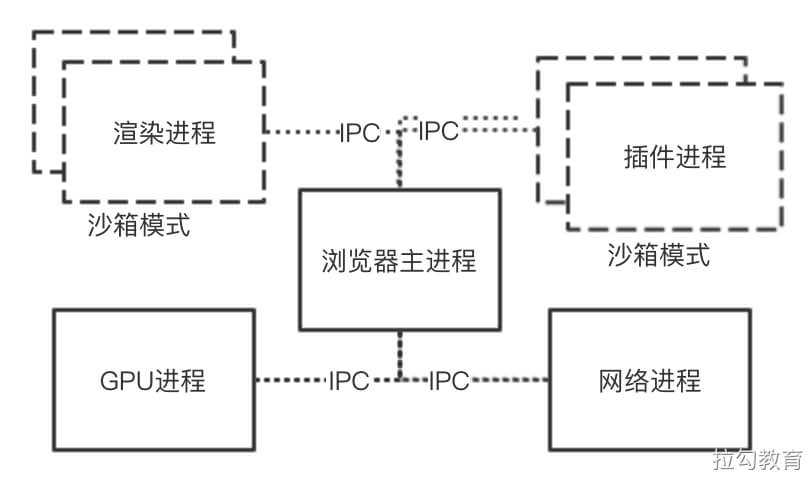

多浏览器进程：

1. 浏览器主进程：一个浏览器只有一个主进程。负责如菜单栏、文件访问、前进后退等以及子进程管理等。

2. GPU进程：用于负责实现3D CSS绘制效果。并将GPU加速应用到Video、Canvas等标签渲染上。

3. 插件进程：主进程为每个使用的浏览器插件开辟新的进程，其以沙箱形式运行插件。

4. 网络进程：负责页面的网络资源加载，之前属于浏览器主进程的一个模块，最近才独立出来。

5. 渲染进程：也称为浏览器 **内核** ，其默认会为 **每个标签窗口页开辟一个独立的进程**，负责将HTML、CSS、和JavaScript等资源转为可交互的页面。其包含多个子线程：

   1. JS引擎线程
   2. GUI渲染线程
   3. 事件触发线程
   4. 定时触发器线程
   5. 异步HTTP请求线程
   6. ...

   渲染进程也被放入沙箱中 

## 建立 HTTP

### DNS 解析

域名解析流程图：

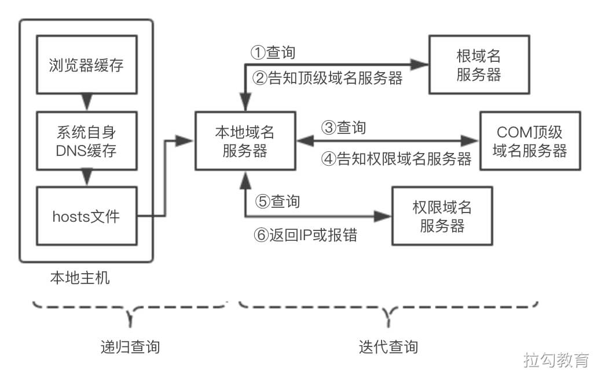

### 网络模型

通过DNS解析获取到目标服务器IP后，就可以建立网络连接了。

网络通信架构图：

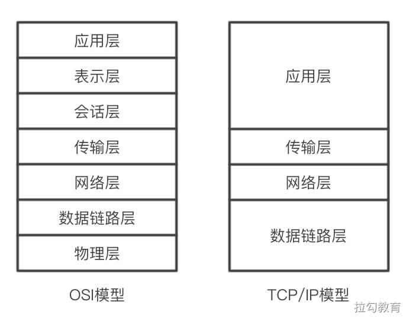

### TPC 连接

通过传输层建立端到端的连接，因此常见有TCP和UDP协议

建立连接3次握手图：

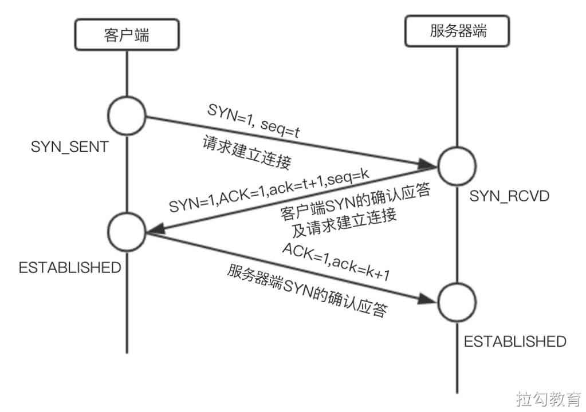

断开连接4次挥手图：

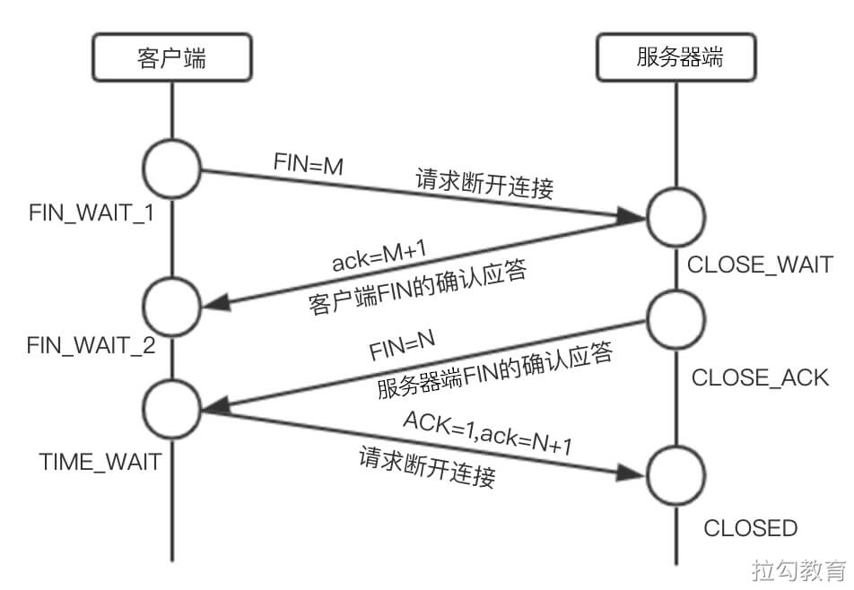

#### QA：为什么三次握手建立的TCP客户端最后还要发送一次确认呢？

> 主要防止已经失效的连接请求报文突然又传送到了服务器，从而产生错误。

> 如果使用的是两次握手建立连接，假设有这样一种场景，客户端发送了第一个请求连接并且没有丢失，只是因为在网络节点中滞留的时间太长了，由于 TCP 的客户端迟迟没有收到确认报文，以为服务器没有收到，此时重新向服务器发送这条报文，此后客户端和服务器经过两次握手完成连接，传输数据，然后关闭连接。此时此前滞留的那一次请求连接，网络通畅了到达了服务器，这个报文本该是失效的，但是，两次握手的机制将会让客户端和服务器再次建立连接，这将导致不必要的错误和资源的浪费。

> 如果采用的是三次握手，就算是那一次失效的报文传送过来了，服务端接受到了那条失效报文并且回复了确认报文，但是客户端不会再次发出确认。由于服务器收不到确认，就知道客户端并没有请求连接。

#### QA：为什么建立连接是三次握手，关闭连接确是四次挥手呢？

> 建立连接的时候， 服务器在LISTEN状态下，收到建立连接请求的SYN报文后，把ACK和SYN放在一个报文里发送给客户端。
>
> 而关闭连接时，服务器收到对方的FIN报文时，仅仅表示对方不再发送数据了但是还能接收数据，而自己也未必全部数据都发送给对方了，所以己方可以立即关闭，也可以发送一些数据给对方后，再发送FIN报文给对方来表示同意现在关闭连接，因此，己方ACK和FIN一般都会分开发送，从而导致多了一次。

#### QA：如果已经建立了连接，但是客户端突然出现故障了怎么办？

> TCP 还设有一个保活计时器，显然，客户端如果出现故障，服务器不能一直等下去，白白浪费资源。服务器每收到一次客户端的请求后都会重新复位这个计时器，时间通常是设置为2小时，若两小时还没有收到客户端的任何数据，服务器就会发送一个探测报文段，以后每隔75秒发送一次。若一连发送10个探测报文仍然没反应，服务器就认为客户端出了故障，接着就关闭连接。

## 前后端交互

### 反向代理服务器

通常大型网站单一服务器资源难以满足期望。一般采用的方式将多个应用服务器组成的集群由反向代理服务器提供给客户端使用。

反向代理服务器的作用如图：

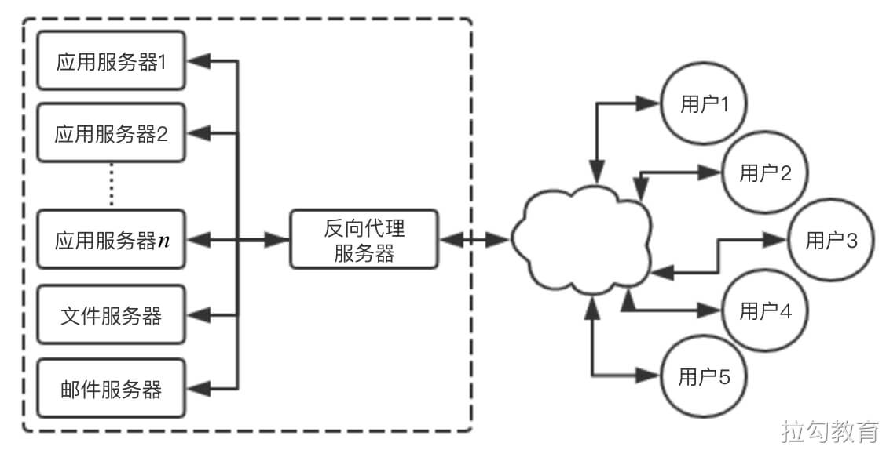

反向代理服务器作用：

1. 负载均衡
2. 安全防火墙
3. 加密及SSL加速
4. 数据压缩
5. 解决跨域
6. 对静态资源缓存

### 后端处理流程

后端通过请求与资源进行业务逻辑的处理后返回。

### HTTP相关协议特性

HTTP是建立在传输层TCP协议之上的应用层协议

长连接：客服务与服务端建立TCP连接后，可以连续发送多个数据包，但需要双方发送心跳检查包来维持连接。

短连接：发送并受到响应后则断开连接。

>  在HTTP1.0时，默认使用短连接。

> 在 HTTP 1.1 时，默认使用长连接，在此情况下，当一个网页的打开操作完成时，其中所建立用于传输 HTTP 的 TCP 连接并不会断开关闭，客户端后续的请求操作便会继续使用这个已经建立的连接。
>
> 如果我们对浏览器的开发者工具留心，在查看请求头时会发现一行 Connection: keep-alive 。
>
> 长连接并非永久保持，它有一个持续时间，可在服务器中进行配置。

> 而在 HTTP 2.0 到来之前，每一个资源的请求都需要开启一个 TCP 连接，由于 TCP 本身有并发数的限制，这样的结果就是，当请求的资源变多时，速度性能就会明显下降。为此，经常会采用的优化策略包括，将静态资源的请求进行多域名拆分，对于小图标或图片使用雪碧图等。

> 在 HTTP 2.0 之后，便可以在一个 TCP 连接上请求多个资源，分割成更小的帧请求，其速度性能便会明显上升，所以之前针对 HTTP 1.1 限制的优化方案也就不再需要了。

#### HTTP2.0新特性

1. 多路复用：一个连接可请求多个资源。

1. 二进制分帧：在应用层和传输层之间，新加入了一个二进制分帧层，以实现低延迟和高吞吐量。
2. 服务器端推送：以往是一个请求带来一个响应，现在服务器可以向客户端的一个请求发出多个响应，这样便可以实现服务器端主动向客户端推送的功能。
3. 设置请求优先级：服务器会根据请求所设置的优先级，来决定需要多少资源处理该请求。
4. HTTP头部压缩：减少报文传输体积。

### 浏览器缓存

缓存策略：强缓存 和 协商缓存。

浏览器使用策略优先级：强缓存 > 协商缓存。如果有强缓存则直接使用，若不生效再进行协商缓存。

协商缓存触发逻辑图：

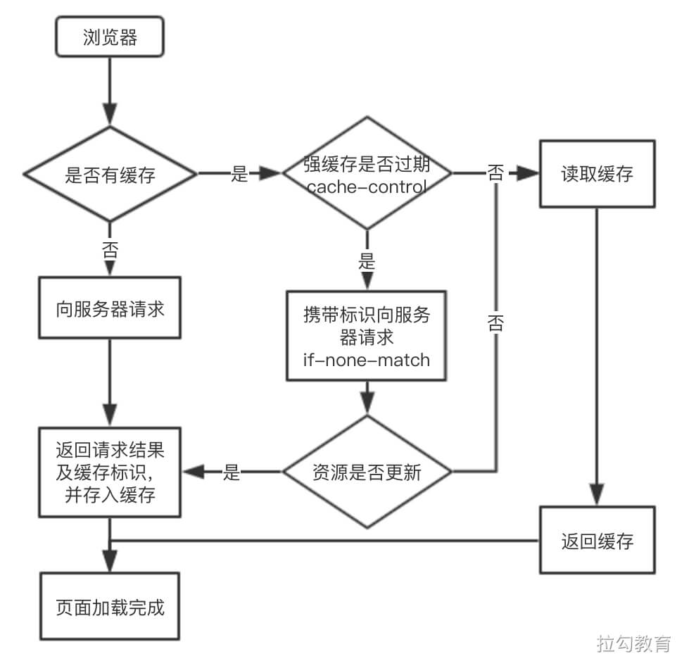

## 关键渲染路径（CRP）

### 构建对象模型

首先浏览器会通过解析 HTML 和 CSS 文件，来构建 **DOM（文档对象模型）** 和 **CSSOM（层叠样式表对象模型）** 。

> 浏览器接收读取到的 HTML 文件，其实是文件根据指定编码（UTF-8）的原始字节，形如 3C 62 6F 79 3E 65 6C 6F 2C 20 73 70…。首先需要将字节转换成字符，即原本的代码字符串，接着再将字符串转化为 W3C 标准规定的令牌结构，所谓令牌就是 HTML 中不同标签代表不同含义的一组规则结构。然后经过词法分析将令牌转化成定义了属性和规则值的对象，最后将这些标签节点根据 HTML 表示的父子关系，连接成树形结构，如下图所示。

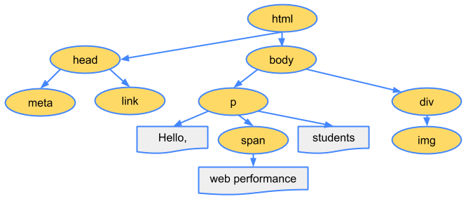

### 构建CSSOM

CSSOM负责各元素经过渲染后的外观呈现。其与`HTML`文件解析的过程类似。

最后构建好的CSSOM树如图：

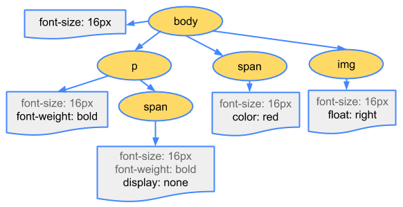

### 渲染绘制

当完成DOM和CSSOM构建后，所得到的是描述最终渲染页面的两个对象。

接下来就是将这两个对象模型合并成渲染树，渲染树中只包含 **可见的节点**，该合并而成的渲染树对象如下：

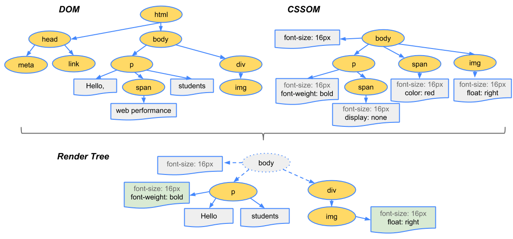

#### 渲染绘制的步骤

1. 从所生成 DOM 树的根节点开始向下遍历每个子节点，忽略所有不可见的节点（脚本标记不可见、CSS 隐藏不可见），因为不可见的节点不会出现在渲染树中。
2. 在 CSSOM 中为每个可见的子节点找到对应的规则并应用。
3. 布局阶段，根据所得到的渲染树，计算它们在设备视图中的具体位置和大小，这一步输出的是一个“盒模型”。

4. 绘制阶段，将每个节点的具体绘制方式转化为屏幕上的实际像素。

## 参考链接

- https://developer.mozilla.org/en-US/docs/Web/Performance/How_browsers_work
- https://zhuanlan.zhihu.com/p/80551769
- https://docs.microsoft.com/zh-cn/microsoft-edge/extensions-chromium/getting-started/
- https://blog.csdn.net/qzcsu/article/details/72861891
- https://zhuanlan.zhihu.com/p/53374516