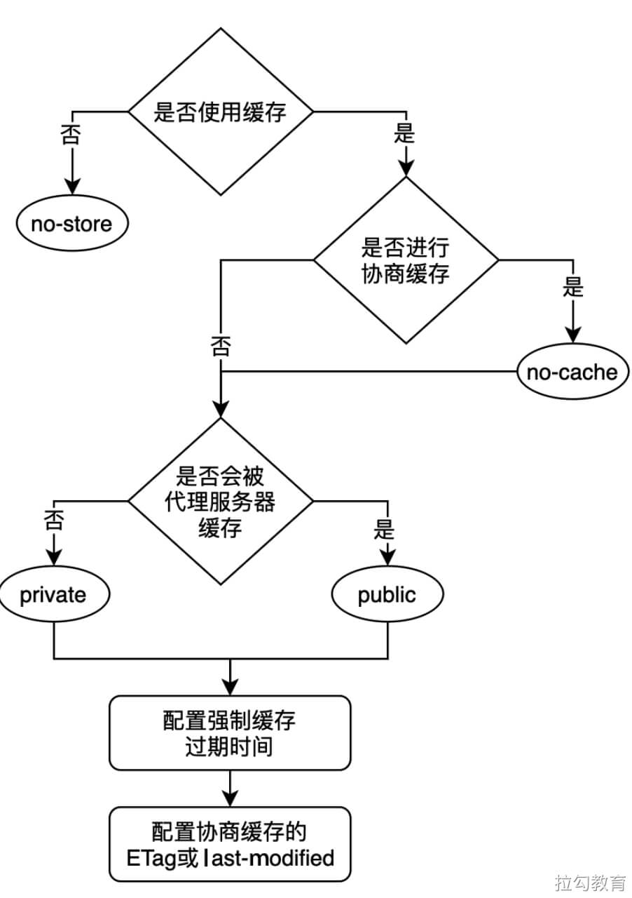
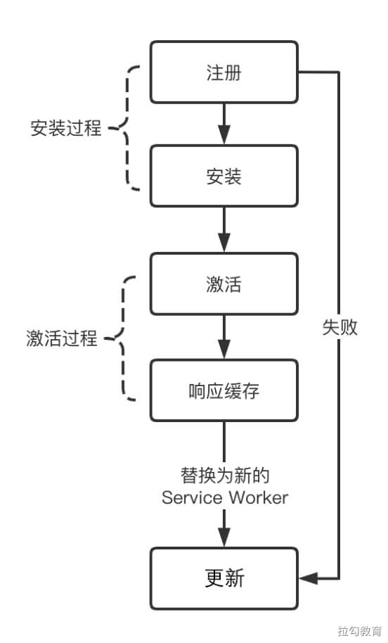
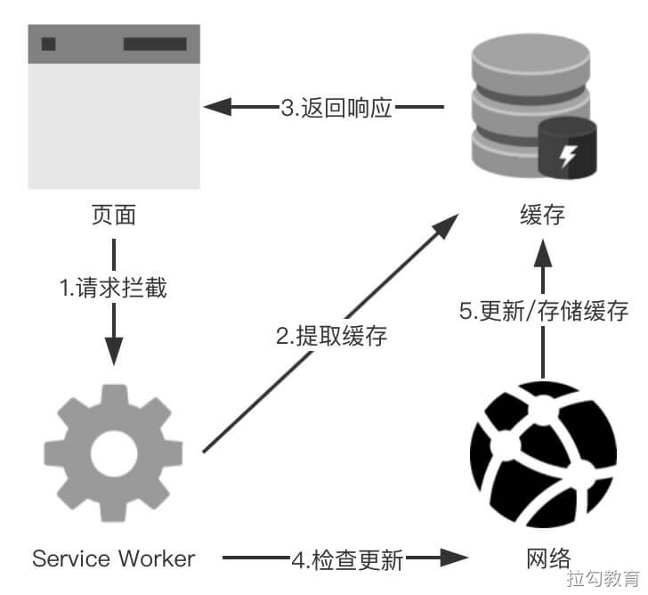

# 前端性能优化

[参考拉钩教育总结](https://www.yuque.com/books/share/bee30889-85b8-442e-be5c-6c683f783e2f/sz3d6g)


## 请求和响应优化

目的：更快的内容到达时间


### DNS 解析优化

- 减少DNS的请求次数
- 进行DNS预获取：DNS Prefetch

为了减少DNS查找和允许高度并行下载，原则将资源划分为至少两个但不超过四个域名


#### dns-prefetch

DNS-prefetch是尝试在请求资源之前解析域名，这适用于页面首次加载完成后要加载的文件或用户尝试打开的链接目标（针对网页中的跨域资源请求）。可以帮助开发人员 **掩盖** DNS解析延迟。

通过HTML文档标签标识：

```html
<link ref="dns-prefetch" href="https://fonts.googleapis.com" />
```

通过HTTP Link 请求头标识：

```xml
Link: <https://fonts.gstatic.com/ >; ref=dns-prefetch
```

注意事项：

1. `dns-prefetch` 仅对跨域域上的DNS查找有效。因为当前域在首次访问时已经完成了DNS解析。
2. `dns-prefetch` 需慎用，**多页面** 重复DNS预解析会增加重复DNS查询。
3. 默认情况下浏览器的隐式`dns-prefetch`会对页面中和当前域下，不在同一个域的域名进行预获取。
4. 虽然DNS Prefetch 能加快页面的解析速度，但是也容易导致DNS查询次数的浪费。

```html
// 禁用DSN预查询
<meta http-equiv="x-dns-prefetch-control" content="off" />
```


#### 其它DNS解析优化

1. 延长DNS缓存时间
2. 尽可能使用A或AAAA记录代替CNAME
3. 使用CDN加速域名
4. 自己搭建DNS服务


### HTTP 长连接

#### 长连接

HTTP1.1引入默认长连接方式，可以被多个请求复用。（不用显式声明Connection：keep-alive）

客户端和服务器发现对方一段时间没有活动，就可以主动关闭连接。

显式关闭连接，客户端请求头标识：

```xml
Connection: close
```


#### 管道机制

HTTP1.1引入，在同一个TCP连接里，客户端可以同时发送多个请求。


#### Content-Length 字段

一个TCP连接可以发送多个回应，利用`Content-Length`字段，告诉浏览器本次回应的数据长度：

```xml
Content-Length：3495
```


#### 分块传输编码

使用 `Content-Length` 字段时，服务器必须知道回应的数据长度。

因此如果一些耗时的动态操作，服务器要等到所有操作完成才能发送数据，效率不高。

因此更好的处理，是产生一块数据，就发送一块。

采用`流模式（stream）`取代`缓存模式（buffer)`，HTTP1.1规定使用`Transfer-Encoding`字段代替`Content-Length`。

```xml
Transfer-Encoding: chunked
```


#### 长连接缺点

由于同一个TCP持久连接里，所有通讯是 **按序** 串行进行的，容易造成 **队头堵塞**。

优化：

1. 减少请求数（资源合并等）
2. 同时多开持久连接（域名分片）


### HTTP2

基于谷歌自研 `SPDY` 协议


#### 二进制协议

HTTP1.1版的头信息是文本（ASCII编码），数据体可以是文本也可以是二进制。

HTTP2则是一个彻底的二进制协议，头和数据体都是二进制，并称为：**头信息帧** 和 **数据帧**。


#### 多工

多工：双向的、实时的通信

HTTP2复用TCP连接。**在一个连接里，客户端和浏览器都可以同时发送多个请求和回应，并且不用按照顺序一一对应**。这样就避免了 **队头堵塞** 。


#### 数据流

HTTP2的数据包是不按顺序发送的，同个连接里连续的数据包，可能属于不同的回应。因此其对数据包做了标记。

HTTP2将每个请求或回应的 **所有数据包**，称为一个**数据流**。每个数据流都有一个独一无二的编号。

规定：客户端发出的数据流，ID一律为奇数，服务器发出的ID为偶数。

同时数据流发送过程中，客户端和服务端都可以发送信号（RES_STREAM帧），取消这个数据流而不需关闭TCP连接。

客户端还可以指定数据流的优先级。优先级越高，服务器越早回应。


#### 头信息压缩

HTTP协议不带有状态，每次请求都必须附上所有信息。因此很多字段是重复的，比如Cookie和User Agent。

HTTP2引入头信息压缩机制

1. 头信息使用 `gzip` 或 `compress` 压缩后再发送。
2. 客户端和服务端同时维护一张头信息表，所有字段都存入这个表，生成一个索引号，这样以后出现重复的字段，只发送索引号就可以提高速度了。


#### 服务器推送

HTTP2允许服务器未经请求，主动向客户端发送资源。


#### 参考链接

- https://developers.google.com/web/fundamentals/performance/http2?hl=zh-cn


### 避免重定向

#### 永久重定向

这种重定向被认为是永久性的，搜索引擎机器人会遇到该状态码时触发更新操作。

| 编码 | 含义               | 处理方法                                         | 典型应用场景              |
| ---- | ------------------ | ------------------------------------------------ | ------------------------- |
| 301  | Moved Permanently  | GET方法不会发生变更，其它方法有可能变更为GET方法 | 网站重构                  |
| 308  | Permanent Redirect | 方法和消息主体都不发生变化。                     | 网站重构，用于非GET方法。 |


#### 临时重定向

搜索引擎不会记录该更新、临时的连接。

| 编码 | 含义               | 处理方法                                                     | 典型应用场景                                                 |
| ---- | ------------------ | ------------------------------------------------------------ | ------------------------------------------------------------ |
| 302  | Found              | GET方法不会发生变更，其它方法有可能会变更为GET               | 由于不可预见的原因，该页面暂时不可用。                       |
| 303  | See Other          | GET方法不会发生变更，其它方法会变更为GET方法（消息主体会丢失） | 用于PUT或POST请求完成之后进行页面转跳来防止由于页面刷新导致的操作的重复触发。 |
| 307  | Temporary Redirect | 方法和消息主体都不发生变化                                   | 由于不可预见的原因，该页面暂时不可用。当站点支持非GET方法的请求时，该状态码优于302状态均码。 |


#### 特殊重定向

两种特殊的重定向

| 编码 | 含义            | 典型应用场景                                                 |
| ---- | --------------- | ------------------------------------------------------------ |
| 300  | Multiple Choice | 不常用：所有选项在消息主体的HTML中列出。                     |
| 304  | Not Modified    | 发送用于重新验证的条件请求。表示缓存的响应仍然是新鲜的并且可以使用。 |


### 压缩传输的数据资源


#### HTTP响应数据压缩

##### 压缩JS、CSS


##### 使用Gzip压缩

浏览器和服务器之间会使用 **主动协商机制**。

浏览器通过发送 `Accept-Encoding：gzip，deflate，...` 首部，告诉服务器它所支持的压缩算法及各自优先级。

服务器则按优先级和自身支持从中选择一种，对响应的消息主体进行压缩，并且发送`Content-Encoding`首部来告诉浏览器使用的哪一种算法。

请求报文：

```xml
GET /baidu HTTP/1.1
Host：www.baidu.com
Accept-Encoding：gzip，deflate
```

响应报文：

```xml
HTTP/1.1 200 OK
...
Content-Encoding：gizp
...
```


##### 压缩图片


#### HTTP请求数据压缩

##### 头部数据压缩


##### 请求体数据压缩

三种数据压缩格式

1. DEFLATE：是一种使用`Lempel-Ziv（LZ77)`压缩算法和`哈弗曼编码`的压缩格式。详见[RFC 1951](https://datatracker.ietf.org/doc/rfc1951/)
2. ZLIB：是一中和使用`DEFLATE`的压缩格式，对应HTTP中的 `Content-Encoding：deflate`。详见[RFC 1950](https://datatracker.ietf.org/doc/html/rfc1950)
3. GZIP：是一种使用`DEFLATE`的压缩格式，对应HTTP中的`Content-Encoding: gzip`。详见[RFC 1952](https://datatracker.ietf.org/doc/html/rfc1952)

ZLIB和GZIP都是DEFLATE的不同`Wrapper`。


### HTTP缓存

缓存的技术大致分为两大类：共享缓存和私有缓存。

共享缓存指的是缓存内容可被多个用户使用。

私有缓存指的是只能被单个用户使用，如浏览器缓存。


#### 强制缓存

HTTP1.0：`expires`字段控制，过度依赖客户端本地时间戳，可能会出现不符合预期的情况。

HTTP1.1：`cache-control`，以`S`为单位的相对时间，表示资源被请求后多少秒内有效。

目前`cache-control`能作为`expires`的完全替代方案，但依然可使用`expires`作为可用性方面的向下兼容。


##### no-cache 和 no-store

一组互斥的属性值

no-cache：强制使用协商缓存。

no-store：禁止使用任何缓存策略。


#### private 和 public

一组互斥的属性值。

用以明确响应资源是否可被代理服务器进行缓存。

public：响应资源既可以被浏览器缓存，又可以被代理服务器缓存。

private：限制响应资源只能被浏览器缓存。（默认行为）

```http
Cache-Control:public，max-age=31536000
```


##### max-age 和 s-maxage

max-age：服务器端告知客户端浏览器响应资源的过期时长。

s-maxage：表示缓存在代理服务器中的过期时长，且仅当设置了 `public` 属性值时才有效。


#### 协商缓存

协商缓存：在使用本地缓存之前，向服务器发起一次GET请求，与之协商当前浏览器保存的本地缓存是否已过期。

过程：

1. 服务端首次返回资源响应头中包含一个名为`last-modified`的资源，该字段为此文件最近一次修改时间戳。
2. 客户端再次请求此资源时，请求头中包含一个`ifmodified-since`字段，此值为上次响应头中的`last-modified`字段。
3. 协商缓存有效，返回`304`状态码。

协商缓存判断缓存有效的响应码是`304`，即响应重定向到本地缓存上。

强制缓存若有效，则再次请求的响应状态码是200。


##### last-modified 的不足

1. 资源经过编辑，但内容无任何变化也会更新时间戳导致缓存失效。

2. 标记文件资源修改的时间戳单位是**秒**，如果文件修改速度在秒级以内，则无法识别出该文件的资源已更新。

   

##### 基于ETag 的协商缓存

为了弥补时间戳判断的不足，从HTTP1.1规范开始新增`ETag`的头信息。

服务器为不同资源进行 **哈希运算** 所生产的一个字符串。

`ETag` 优先级大于 `last-modified`。

服务端提供`ETag`响应头，客户端将之前的`ETag`值作`If-Node-Match`字段值作为请求头。

缓存验证有效，依然返回`304`状态码。


ETag字段生成分类：

- 强验证：根据资源内容生成，保证每个字节相同

- 弱验证：根据资源的部分属性值来生成，无法保证每个字节相同。

  

ETag的不足：

1. 服务器对于生成文件资源的`ETag`值计算开销问题。文件资源过大或修改频繁，会影响服务器性能。


#### 缓存决策




#### 注意事项

1. 根域下的缓存是共享的。比如`a.com`、`foo.a.com`、`bar.a.com`。


### Service Worker 缓存

Service Worker 伴随着Google推出的 **PWA** 一同出现的技术。
Service Worker 在 **Web Worker** 的基础上，增加了对离线缓存的管理能力，以弥补HTML5上采用 **AppCache** 实现离线缓存的诸多缺陷。

#### 基本特征

1. 独立于浏览器主线程，无法直接操作DOM。
2. 开发过程中支持`localhost`，线上环境必须部署在`HTTPS`下。
3. 能够监听并拦截全站的网络请求，从而进行自定义请求响应控制。
4. 在不使用的时候会被中止，在需要的时候进行重启。所以持久化**全局状态**，需要借助IndexedDB API。
5. 广泛使用`Promise`来处理异步。
6. 消息推送。
7. 后台同步。

#### 生命周期

生命周期流程图：



1. **注册**

```js
if ('serviceWorker' in navigator) {
  window.addEventListener('load', () => {
    navigator.serviceWorker.register('/service-worker.js');
  })
}
```

2. **安装** 

安装阶段，下载`/service-worker.js`，解析并执行成功之后，触发`install`事件。  
在`install`事件阶段，Service Worker 还并未获得页面的控制权，不能监听页面上的请求事件，但可以执行一些与页面没有直接操作关系的其它任务。

注意：这个控制权限制为了确保整个过程中，页面仅有一个Service Worker控制，且每次仅运行唯一的一个版本。

```js
const cacheName = 'v1';

this.addEventListener('install', event => {
  event.waitUntil(
    caches.open(cacheName).then(cache => {
      return cache.addAll([
        '/dist/index.js',
        '/dist/css/index.css'
      ])
    })
  )
})
```

3. **激活**

安装期结束后，可以通过 **直接刷新浏览器** 激活 Service Worker，或者调用API来逐出当前旧的SW，激活新的SW。  

```js
self.addEventListener('install', event => {
  self.skipWaiting()
})

self.addEventListener('activate', event => {
  console.log('sw activated')
})
```

4. **响应缓存**

当进入激活状态后，便可以接收页面所发出的 `fetch` 事件来进行缓存响应的相关操作。

```js

this.addEventListener('fetch', event => {
  event.respondWith(async () => {
    try {
      // 1. 使用caches.match()方法在本地缓存中进行检索匹配
      let response = await caches.match(event.request);

      if (!response) {
        // 2. 没有缓存通过fetch方法重新发起请求
        response = await fetch(event.request.clone())

        // 3. 将新请求的资源缓存起来
        const cache = await caches.open(cacheName)
        cache.put(event.request, response.clone())
      }
      return response;
    } catch(err) {
      return caches.match('xxxxxx')
    }
  })
})
```

5. **更新**

#### 高性能加载 

静态资源高效加载策略示意图：



示例代码：

```js
self.addEventListener('fetch', event => {
  if (event.request.mode === 'navigate') {
    event.respondWith(async () => {
      const normalizedUrl = new URL(event.request.url);
      normalizedUrl.search = '';

      const fetchResponse = fetch(normalizedUrl);
      const fetchResponseClone = fetchResponse.then(r => r.close());

      event.waitUntil((async () => {
        const cache = await cached.open('cacheName')
        await cache.put(normalizedUrl, await fetchResponseClone)
      }()))

      return (await cached.match(normalizedUrl)) || fetchResponse
    }())
  }
})
```

#### 参考

- https://developer.mozilla.org/zh-CN/docs/Web/API/Service_Worker_API/Using_Service_Workers
- https://developer.mozilla.org/en-US/docs/Web/API/Service_Worker_API
- https://github.com/mdn/sw-test