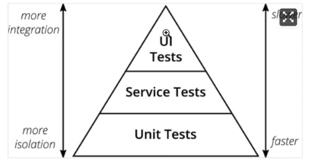

# 自动化测试

## 测试分类 

前端开发常见的测试：

1. 单元测试：验证独立单元是否正常工作
2. 集成测试：验证多个单元协同工作
3. 端到端测试（E2E)：从用户角度以机器的方式在真实浏览器环境验证应用交互
4. 快照测试：验证程序的 UI 变化
  
### 单元测试

优点：

- 提升代码质量、减少Bug
- 快速反馈，减少调试时间
- 让代码维护更容易
- **有助于代码的模块化设计**
- **代码覆盖率高**

缺点：

- 由于单元测试是独立的，无法保证多个单元运行到一起是正确的

常见单元测试框架

- Jest (推荐)
- Mocha
- ...

### 集成测试

优点：

1. 从用户的使用角度出发，更容易获得软件使用中的正确性
2. 集成测试相对于写了软件的说明文档
3. 由于不关注底层代码实现细节，所以更有利于快速重构
4. 相比单元测试，集成测试的开发速度要更快一些

缺点：

1. 测试失败的时候无法快速定位问题
2. 代码覆盖率较低
3. 速度不单元测试要慢

### E2E测试

E2E测试可以从用户的视角通过浏览器自动检查应用程序是否正常工作。

优点：

1. 真实的测试环境，更容易获得程序的信心

缺点：

1. E2E测试运行较慢
2. 吊事起来比较困难

常见E2E测试框架

- Cypress (推荐)
- Nightwatch
- ...

### 快照测试

给运行中的应用程序拍一张照片，将其与以前保存的图片进行比较。对于 **UI组件** 库很有帮助，例如`antd`、`vant组件库都有使用。

## 测试金字塔

**测试是需要分层的**

自下而上分为，*单元测试*、*集成测试*、*UI测试*，之所以是金字塔结构是因为单元测试的成本最低，与之相对，UI测试的成本最高。
所以单元测试写的数量最多，UI测试写的数量最少。同时越是上层的曾是，其通过率给开发者带来的信心是越大的。